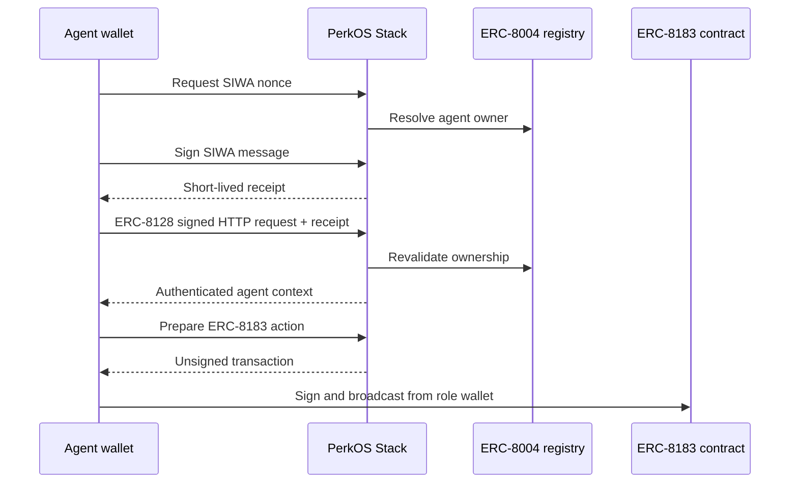

# Reusable agent authentication and commerce

Stack exposes two independent, composable building blocks for agent applications.



## SIWA and ERC-8128

The implementation uses `@buildersgarden/siwa@0.0.24`. SIWA proves that the
signer owns an ERC-8004 agent identity. ERC-8128 then signs each HTTP request,
including its method, URL, content digest, receipt, timestamp, and nonce.

Stack deliberately follows the SDK's owner-only SIWA policy: the signer must be
the current result of `ownerOf(agentId)`. A distinct ERC-8004 `agentWallet` is
not accepted by this SIWA v1 flow. Supporting delegated agent wallets requires
a separately versioned policy and receipt format so ownership revalidation is
not weakened implicitly.

Endpoints:

| Method | Path | Purpose |
| --- | --- | --- |
| `GET` | `/.well-known/siwa.json` | Public configuration and supported identity networks |
| `POST` | `/api/v2/agents/siwa/nonce` | Issue a one-time SIWA nonce after resolving the agent owner |
| `POST` | `/api/v2/agents/siwa/verify` | Consume the nonce, verify the SIWA signature, and issue a receipt |
| `GET`/`POST` | `/api/v2/agents/siwa/session` | Example endpoint protected by receipt + ERC-8128 |

Production configuration:

```dotenv
SIWA_RECEIPT_SECRET=<at-least-32-random-characters>
SIWA_DOMAIN=stack.perkos.xyz
SIWA_PUBLIC_ORIGIN=https://stack.perkos.xyz
SIWA_NONCE_STORE=firestore
SIWA_NONCE_TTL_MS=300000
SIWA_RECEIPT_TTL_MS=1800000
```

Nonce consumption is atomic in Firestore. Memory storage is available only for
local development with `SIWA_NONCE_STORE=memory`; it is not safe for a
multi-instance deployment. The canonical URI, chain ID, and ERC-8004 registry
are checked before a receipt is issued. Protected requests revalidate agent
ownership on-chain and reject nonce replay.

An ERC-8128 signature is bound to the exact request URL. A request signed for a
MandateMesh endpoint cannot be replayed against Stack. A first-party application
can either run the verifier locally with the shared receipt secret or proxy the
operation through a protected Stack endpoint. Do not expose
`SIWA_RECEIPT_SECRET` to a browser or an untrusted third party.

## ERC-8183

ERC-8183 is currently a draft agentic-commerce protocol. Stack pins the official
reference contracts at commit
`142e669c1fd318486a4628395b629f033654dd06` instead of following a moving branch.
The deployed artifact is `PerkOSAgenticCommerce`, which inherits the upstream
base `ERC8183` implementation. The optional `ERC8183WithAuthorization` extension
is not used because its runtime bytecode exceeds the EIP-170 limit. Stack instead
prepares role transactions that the client, provider, or evaluator signs directly.

The lifecycle is:

1. The client creates a job with provider, evaluator, expiry, and optional
   ERC-8004 provider agent ID.
2. The provider sets the token and budget.
3. The client approves the token and funds the job.
4. The provider submits a `bytes32` deliverable reference, normally a hash of
   content-addressed evidence.
5. The evaluator completes the job and releases payment, or rejects it and
   refunds the client.

Stack exposes `GET|POST /api/v2/erc8183/jobs`. `GET` returns deployment data or
reads a job. `POST` validates an action and returns `{to, data, value, chainId}`.
The caller signs and broadcasts the transaction; Stack does not custody role
wallets or submit transactions on their behalf.

Supported POST actions cover every non-administrative role operation:
`createJob`, `setProvider`, `setPayoutReceiver`, `setBudget`, `fund`, `submit`,
`complete`, `reject`, `claimRefund`, `submitClaim`, `settleClaim`,
`approveClaim`, and `rejectClaim`. Pause, allowlist, fee, emergency withdrawal,
and upgrade operations remain deployment-administration concerns and are not
exposed through the public job API. Configure deployments per network:

```dotenv
NEXT_PUBLIC_ROBINHOOD_ERC8183_ADDRESS=0x...
NEXT_PUBLIC_ROBINHOOD_TESTNET_ERC8183_ADDRESS=0x...
```

Only tokens explicitly allowlisted by the ERC-8183 administrator can fund jobs.
For Robinhood Chain Testnet, the intended test token is USDG at
`0x7E955252E15c84f5768B83c41a71F9eba181802F`.

## Sponsor rule migration

Historical sponsor rules can be normalized safely with a dry run followed by
an explicit apply. The lookup keeps a case-insensitive compatibility fallback
while environments are migrated.

```bash
npm run migrate:sponsor-addresses
npm run migrate:sponsor-addresses -- --apply
```

## Source map

```text
Stack/
├── StackApp/
│   ├── app/api/.well-known/siwa.json/route.ts
│   ├── app/api/v2/agents/siwa/{nonce,verify,session}/route.ts
│   ├── app/api/v2/erc8183/jobs/route.ts
│   ├── lib/siwa/{config,network,stores,verifyRequest}.ts
│   ├── lib/erc8183/config.ts
│   ├── lib/contracts/erc8183/abi.ts
│   └── tests/siwa.test.cjs
└── SmartContracts/
    ├── lib/erc-8183-base-contracts/       # pinned official implementation
    ├── src/erc8183/PerkOSAgenticCommerce.sol
    ├── script/DeployERC8183.s.sol
    └── test/PerkOSAgenticCommerce.t.sol
```

## Verification

```bash
cd StackApp
npm run typecheck
npm test

cd ../SmartContracts
forge test --match-contract PerkOSAgenticCommerceTest \
  --skip IdentityRegistry.sol \
  --skip ReputationRegistry.sol \
  --skip ValidationRegistry.sol \
  --skip DeferredPaymentEscrowUpgradeable.sol \
  --skip DeployUpgradeable.s.sol
```

The skips isolate the ERC-8183 module from legacy contracts that predate the
pinned OpenZeppelin dependency. The upstream reference suite can be run from
`SmartContracts/lib/erc-8183-base-contracts` with `forge test`.
