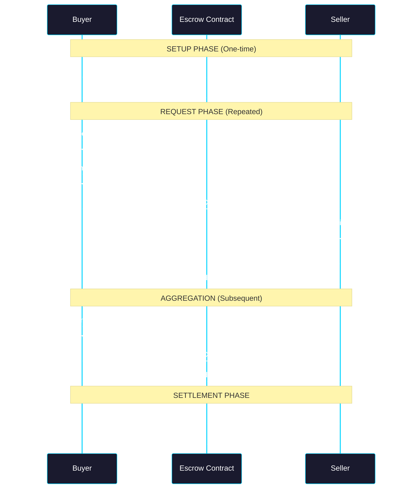
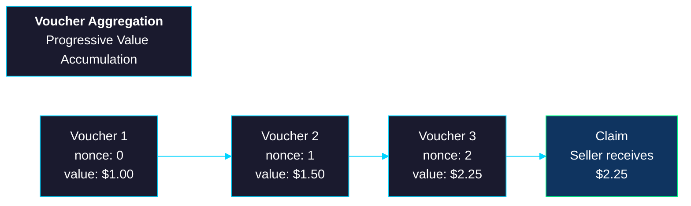

# x402 Deferred Payment Scheme

Complete documentation for the x402 deferred payment scheme implementation based on [PR #426](https://github.com/coinbase/x402/pull/426).

## Table of Contents

1. [Overview](#overview)
2. [Standard Compatibility](#standard-compatibility)
3. [How It Works](#how-it-works)
4. [Voucher Structure](#voucher-structure)
5. [API Reference](#api-reference)
6. [Escrow Contract](#escrow-contract)
7. [Client Integration](#client-integration)
8. [Server Integration](#server-integration)
9. [Security Considerations](#security-considerations)

## Overview

The **deferred scheme** extends x402 with voucher-based payments using an on-chain escrow system. Unlike the `exact` scheme which settles immediately on each request, deferred payments aggregate multiple requests and settle in batches.

### When to Use Deferred

| Use Case | Exact Scheme | Deferred Scheme |
|----------|--------------|-----------------|
| One-off API calls | Best choice | Overhead |
| High-frequency calls | Gas expensive | Best choice |
| AI agent sessions | Latency | Best choice |
| Subscription patterns | Per-request | Best choice |

### Key Benefits

- **Lower gas costs**: Batch many payments into single settlement
- **Lower latency**: Off-chain signature verification (~100ms vs ~2s)
- **Session support**: Aggregate payments across a session
- **Buyer control**: Deposits locked in escrow, not held by seller

## Standard Compatibility

This implementation is **fully backward compatible** with the x402 standard.

### Standard Request Format

Both `/verify` and `/settle` use the exact CDP format:

```json
{
  "x402Version": 1,
  "paymentPayload": {
    "x402Version": 1,
    "scheme": "exact",
    "network": "avalanche",
    "payload": { ... }
  },
  "paymentRequirements": {
    "scheme": "exact",
    "network": "avalanche",
    "maxAmountRequired": "1000000",
    "resource": "https://...",
    "payTo": "0x...",
    "maxTimeoutSeconds": 60,
    "asset": "0x..."
  }
}
```

### Standard Responses

**Verify Response:**
```json
{
  "isValid": true,
  "invalidReason": null,
  "payer": "0x..."
}
```

**Settle Response:**
```json
{
  "success": true,
  "error": null,
  "payer": "0x...",
  "transaction": "0x...",
  "network": "avalanche"
}
```

**Supported Response:**
```json
{
  "kinds": [
    { "scheme": "exact", "network": "avalanche" },
    { "scheme": "deferred", "network": "avalanche" }
  ]
}
```

## How It Works

### Payment Flow Diagram



### Voucher Aggregation Flow



### Step-by-Step Flow

1. **Buyer deposits** USDC to escrow contract for a specific seller
2. **Buyer creates voucher** with initial amount and nonce=0
3. **Buyer signs voucher** using EIP-712 typed data
4. **Buyer sends request** with voucher in X-PAYMENT header
5. **Seller verifies** signature and escrow balance
6. **Seller provides service**
7. **For next request**, buyer increments nonce and valueAggregate
8. **Seller claims** when ready (individual or batch)

## Voucher Structure

### TypeScript Interface

```typescript
interface Voucher {
  id: `0x${string}`;        // bytes32 - Unique session ID
  buyer: `0x${string}`;     // address - Payment initiator
  seller: `0x${string}`;    // address - Payment recipient
  valueAggregate: bigint;   // uint256 - Total amount (monotonically increasing)
  asset: `0x${string}`;     // address - ERC-20 token (e.g., USDC)
  timestamp: bigint;        // uint64  - Last update time
  nonce: bigint;            // uint256 - Increments with each update
  escrow: `0x${string}`;    // address - Escrow contract
  chainId: bigint;          // uint256 - Network chain ID
}
```

### EIP-712 Type Definition

```typescript
const VoucherTypes = {
  Voucher: [
    { name: "id", type: "bytes32" },
    { name: "buyer", type: "address" },
    { name: "seller", type: "address" },
    { name: "valueAggregate", type: "uint256" },
    { name: "asset", type: "address" },
    { name: "timestamp", type: "uint64" },
    { name: "nonce", type: "uint256" },
    { name: "escrow", type: "address" },
    { name: "chainId", type: "uint256" }
  ]
};

const domain = {
  name: "X402DeferredEscrow",
  version: "1",
  chainId: 43114,
  verifyingContract: escrowAddress
};
```

### Voucher Aggregation Rules

| Request | Nonce | ValueAggregate | Notes |
|---------|-------|----------------|-------|
| Initial | 0 | $1.00 | First request |
| Second | 1 | $1.50 | Added $0.50 |
| Third | 2 | $2.25 | Added $0.75 |
| Claim | - | - | Seller receives $2.25 |

## API Reference

### Standard x402 Endpoints

These work for both `exact` and `deferred` schemes:

#### POST /api/v2/x402/verify

```bash
curl -X POST https://your-facilitator.com/api/v2/x402/verify \
  -H "Content-Type: application/json" \
  -d '{
    "x402Version": 1,
    "paymentPayload": {
      "x402Version": 1,
      "scheme": "deferred",
      "network": "avalanche",
      "payload": {
        "voucher": {
          "id": "0x...",
          "buyer": "0x...",
          "seller": "0x...",
          "valueAggregate": "1000000",
          "asset": "0xB97EF9Ef8734C71904D8002F8b6Bc66Dd9c48a6E",
          "timestamp": "1735689600",
          "nonce": "0",
          "escrow": "0x...",
          "chainId": "43114"
        },
        "signature": "0x..."
      }
    },
    "paymentRequirements": {
      "scheme": "deferred",
      "network": "avalanche",
      "maxAmountRequired": "1000000",
      "resource": "https://api.example.com/service",
      "payTo": "0x...",
      "maxTimeoutSeconds": 60,
      "asset": "0xB97EF9Ef8734C71904D8002F8b6Bc66Dd9c48a6E",
      "extra": {
        "type": "new",
        "escrow": "0x..."
      }
    }
  }'
```

#### POST /api/v2/x402/settle

Same request format as verify. For deferred scheme, this stores the voucher for later batch settlement.

#### GET /api/v2/x402/supported

```json
{
  "kinds": [
    { "scheme": "exact", "network": "avalanche" },
    { "scheme": "exact", "network": "base" },
    { "scheme": "exact", "network": "arbitrum" },
    { "scheme": "deferred", "network": "avalanche" },
    { "scheme": "deferred", "network": "base" }
  ]
}
```

### Deferred-Specific Endpoints

#### GET /api/deferred/info

Returns deferred scheme configuration.

```json
{
  "enabled": true,
  "escrowAddress": "0x...",
  "network": "avalanche",
  "chainId": 43114,
  "thawPeriod": 86400,
  "maxDeposit": "10000000"
}
```

#### GET /api/deferred/vouchers

Query stored vouchers.

```bash
curl "https://your-facilitator.com/api/deferred/vouchers?buyer=0x...&seller=0x...&asset=0x..."
```

#### POST /api/deferred/vouchers

Store a voucher (facilitator-managed voucher store).

```json
{
  "voucher": { ... },
  "signature": "0x..."
}
```

#### POST /api/deferred/vouchers/:id/:nonce/settle

Settle a specific voucher on-chain.

#### POST /api/deferred/settle-batch

Batch settle all pending vouchers for a buyer-seller pair.

```json
{
  "buyer": "0x...",
  "seller": "0x..."
}
```

#### GET /api/deferred/escrow/balance

Query escrow balance.

```bash
curl "https://your-facilitator.com/api/deferred/escrow/balance?buyer=0x...&seller=0x...&asset=0x..."
```

## Escrow Contract

### Contract Architecture

```mermaid
%%{init: {'theme': 'base', 'themeVariables': { 'primaryColor': '#1a1a2e', 'primaryTextColor': '#ffffff', 'primaryBorderColor': '#00d4ff', 'lineColor': '#00d4ff', 'secondaryColor': '#16213e', 'tertiaryColor': '#0f3460', 'background': '#0a0a0a', 'mainBkg': '#1a1a2e', 'secondBkg': '#16213e', 'textColor': '#ffffff', 'nodeBorder': '#00d4ff', 'clusterBkg': '#16213e', 'edgeLabelBackground': '#1a1a2e', 'nodeTextColor': '#ffffff' }}}%%
flowchart TB
    subgraph Header["<b>Escrow Contract</b><br/>DeferredPaymentEscrowUpgradeable.sol"]
    end

    subgraph Buyer["BUYER FUNCTIONS"]
        D1["deposit()"]
        D2["depositWithPermit()"]
        D3["depositWithAuthorization()"]
        T1["thaw()"]
        W1["withdraw()"]
        F1["flush()"]
    end

    subgraph Seller["SELLER FUNCTIONS"]
        C1["claimVoucher()"]
        C2["claimVoucherBatch()"]
    end

    subgraph State["CONTRACT STATE"]
        B1[("Balances<br/>buyer -> seller -> asset")]
        T2[("Thaw Requests<br/>buyer -> seller -> asset")]
        N1[("Claimed Nonces<br/>voucherId -> nonce")]
    end

    D1 --> B1
    D2 --> B1
    D3 --> B1
    T1 --> T2
    W1 --> B1
    F1 --> B1
    C1 --> B1
    C1 --> N1
    C2 --> B1
    C2 --> N1

    style D1 fill:#1a1a2e,stroke:#00d4ff,color:#ffffff
    style D2 fill:#1a1a2e,stroke:#00d4ff,color:#ffffff
    style D3 fill:#1a1a2e,stroke:#00d4ff,color:#ffffff
    style T1 fill:#1a1a2e,stroke:#ffaa00,color:#ffffff
    style W1 fill:#1a1a2e,stroke:#ffaa00,color:#ffffff
    style F1 fill:#1a1a2e,stroke:#ffaa00,color:#ffffff
    style C1 fill:#1a1a2e,stroke:#00ff88,color:#ffffff
    style C2 fill:#1a1a2e,stroke:#00ff88,color:#ffffff
    style B1 fill:#0f3460,stroke:#00d4ff,color:#ffffff
    style T2 fill:#0f3460,stroke:#ffaa00,color:#ffffff
    style N1 fill:#0f3460,stroke:#00ff88,color:#ffffff
```



### Key Functions

#### Deposit Functions

```solidity
// Direct deposit
function deposit(address seller, address asset, uint256 amount) external;

// Gasless deposit via ERC-2612 permit
function depositWithPermit(
    address seller,
    address asset,
    uint256 amount,
    uint256 deadline,
    uint8 v, bytes32 r, bytes32 s
) external;

// Gasless deposit via signed authorization
function depositWithAuthorization(
    DepositAuthorization calldata auth,
    bytes calldata signature
) external;
```

#### Withdrawal Functions (Buyer)

```solidity
// Start thaw period (1 day)
function thaw(address seller, address asset, uint256 amount) external;

// Withdraw after thaw period
function withdraw(address seller, address asset) external;

// Gasless thaw+withdraw
function flush(FlushRequest calldata request, bytes calldata signature) external;
```

#### Claim Functions (Seller)

```solidity
// Claim single voucher
function claimVoucher(Voucher calldata voucher, bytes calldata signature) external;

// Batch claim multiple vouchers
function claimVoucherBatch(
    Voucher[] calldata vouchers,
    bytes[] calldata signatures
) external;
```

### Security Features

| Feature | Description |
|---------|-------------|
| **Max Deposit** | $10 per escrow (prevents large locks) |
| **Thaw Period** | 1 day delay before withdrawal (protects sellers) |
| **Replay Protection** | Nonce-based, monotonic valueAggregate |
| **Signature Verification** | EIP-712 typed data signatures |
| **Reentrancy Guard** | All state-changing functions protected |
| **UUPS Upgradeable** | Owner-only upgrades via proxy pattern |

### Upgradeable Contract

PerkOS Stack uses UUPS (Universal Upgradeable Proxy Standard) for the escrow contract:

```bash
# Deploy new proxy
cd StackApp
npm run deploy:avalanche-fuji

# Upgrade existing proxy
PROXY_ADDRESS=0x... npm run upgrade:avalanche-fuji
```

See [DEPLOYMENT_CHECKLIST.md](./DEPLOYMENT_CHECKLIST.md) for complete deployment instructions.

## Client Integration

### TypeScript Example

```typescript
import { createWalletClient, http, parseUnits } from 'viem';
import { avalanche } from 'viem/chains';
import { privateKeyToAccount } from 'viem/accounts';

// Setup
const account = privateKeyToAccount('0x...');
const wallet = createWalletClient({
  account,
  chain: avalanche,
  transport: http()
});

const ESCROW_ADDRESS = '0x...';
const SELLER_ADDRESS = '0x...';
const USDC_ADDRESS = '0xB97EF9Ef8734C71904D8002F8b6Bc66Dd9c48a6E';

// 1. Generate voucher ID (random bytes32)
function generateVoucherId(): `0x${string}` {
  const bytes = new Uint8Array(32);
  crypto.getRandomValues(bytes);
  return `0x${Array.from(bytes).map(b => b.toString(16).padStart(2, '0')).join('')}`;
}

// 2. Create and sign voucher
async function createVoucher(amount: bigint, previousVoucher?: Voucher) {
  const voucher = {
    id: previousVoucher?.id ?? generateVoucherId(),
    buyer: account.address,
    seller: SELLER_ADDRESS,
    valueAggregate: previousVoucher
      ? previousVoucher.valueAggregate + amount
      : amount,
    asset: USDC_ADDRESS,
    timestamp: BigInt(Math.floor(Date.now() / 1000)),
    nonce: previousVoucher ? previousVoucher.nonce + 1n : 0n,
    escrow: ESCROW_ADDRESS,
    chainId: 43114n
  };

  const signature = await wallet.signTypedData({
    domain: {
      name: "X402DeferredEscrow",
      version: "1",
      chainId: 43114,
      verifyingContract: ESCROW_ADDRESS
    },
    types: {
      Voucher: [
        { name: "id", type: "bytes32" },
        { name: "buyer", type: "address" },
        { name: "seller", type: "address" },
        { name: "valueAggregate", type: "uint256" },
        { name: "asset", type: "address" },
        { name: "timestamp", type: "uint64" },
        { name: "nonce", type: "uint256" },
        { name: "escrow", type: "address" },
        { name: "chainId", type: "uint256" }
      ]
    },
    primaryType: "Voucher",
    message: voucher
  });

  return { voucher, signature };
}

// 3. Make request with voucher
async function makeRequest(url: string, voucher: Voucher, signature: string) {
  const paymentPayload = {
    x402Version: 1,
    scheme: "deferred",
    network: "avalanche",
    payload: { voucher, signature }
  };

  const response = await fetch(url, {
    method: 'POST',
    headers: {
      'Content-Type': 'application/json',
      'X-PAYMENT': btoa(JSON.stringify(paymentPayload))
    },
    body: JSON.stringify({ /* your request */ })
  });

  return response;
}

// Usage
async function main() {
  // First request
  const { voucher: v1, signature: s1 } = await createVoucher(parseUnits('1', 6)); // $1.00
  await makeRequest('https://api.example.com/service', v1, s1);

  // Second request (aggregate)
  const { voucher: v2, signature: s2 } = await createVoucher(parseUnits('0.5', 6), v1); // +$0.50
  await makeRequest('https://api.example.com/service', v2, s2);

  // Third request (aggregate)
  const { voucher: v3, signature: s3 } = await createVoucher(parseUnits('0.25', 6), v2); // +$0.25
  await makeRequest('https://api.example.com/service', v3, s3);

  // Total: $1.75 will be claimable by seller
}
```

## Server Integration

### 402 Response with Both Schemes

```typescript
// Return 402 with exact and deferred options
return c.json({
  x402Version: 1,
  accepts: [
    // Standard exact scheme (always include for backward compatibility)
    {
      scheme: "exact",
      network: "avalanche",
      maxAmountRequired: "1000000",
      resource: "https://api.example.com/service",
      payTo: sellerAddress,
      maxTimeoutSeconds: 60,
      asset: USDC_ADDRESS
    },
    // Deferred scheme option
    {
      scheme: "deferred",
      network: "avalanche",
      maxAmountRequired: "1000000",
      resource: "https://api.example.com/service",
      payTo: sellerAddress,
      maxTimeoutSeconds: 60,
      asset: USDC_ADDRESS,
      extra: {
        type: "new",  // or "aggregation" for continuing session
        escrow: ESCROW_ADDRESS,
        facilitator: "https://your-facilitator.com"
      }
    }
  ]
}, 402);
```

### Verifying Deferred Payments

```typescript
import { recoverTypedDataAddress } from 'viem';

async function verifyDeferredPayment(payload: DeferredPayload): Promise<boolean> {
  const { voucher, signature } = payload;

  // 1. Recover signer
  const signer = await recoverTypedDataAddress({
    domain: {
      name: "X402DeferredEscrow",
      version: "1",
      chainId: Number(voucher.chainId),
      verifyingContract: voucher.escrow
    },
    types: { Voucher: [...] },
    primaryType: "Voucher",
    message: voucher,
    signature
  });

  // 2. Verify signer is buyer
  if (signer.toLowerCase() !== voucher.buyer.toLowerCase()) {
    return false;
  }

  // 3. Verify escrow has sufficient balance
  const balance = await escrowContract.read.getAvailableBalance([
    voucher.buyer,
    voucher.seller,
    voucher.asset
  ]);

  if (balance < voucher.valueAggregate) {
    return false;
  }

  return true;
}
```

## Security Considerations

### Security Model


### For Buyers

- **Deposit limits**: Keep deposits small ($10 max recommended)
- **Session isolation**: Use unique voucher IDs per session
- **Monitor escrow**: Check balance before starting sessions

### For Sellers

- **Claim regularly**: Don't let vouchers accumulate indefinitely
- **Verify signatures**: Always verify before providing service
- **Check escrow balance**: Ensure funds exist before service

### Contract Security

- **Thaw period**: 1-day delay protects sellers from race conditions
- **Monotonic values**: valueAggregate can only increase
- **Nonce validation**: Prevents replay attacks
- **ReentrancyGuard**: All external calls protected
- **UUPS upgradeable**: Owner-only upgrades with state preservation

## Multi-Chain Support

The deferred scheme is available on all 16 supported networks. See [MULTI_CHAIN_GUIDE.md](./MULTI_CHAIN_GUIDE.md) for:
- Network-specific escrow addresses
- USDC token addresses per chain
- Deployment instructions

## References

- [x402 Protocol](https://github.com/coinbase/x402)
- [Deferred Scheme PR #426](https://github.com/coinbase/x402/pull/426)
- [EIP-712: Typed Data](https://eips.ethereum.org/EIPS/eip-712)
- [EIP-3009: Transfer With Authorization](https://eips.ethereum.org/EIPS/eip-3009)
- [EIP-2612: Permit](https://eips.ethereum.org/EIPS/eip-2612)
- [Thirdweb Documentation](https://portal.thirdweb.com)
