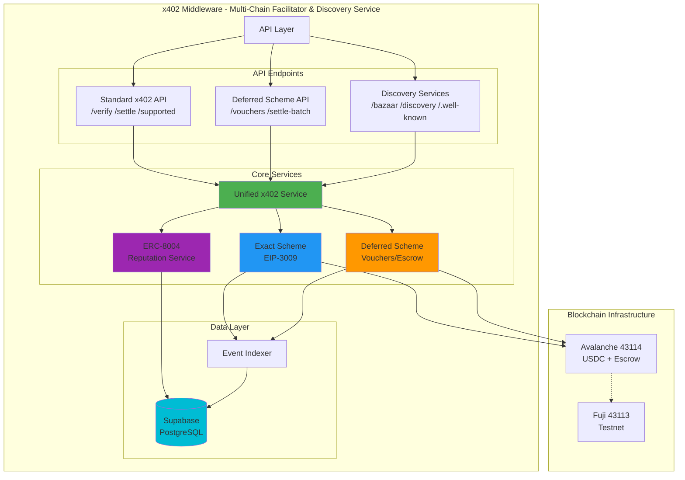
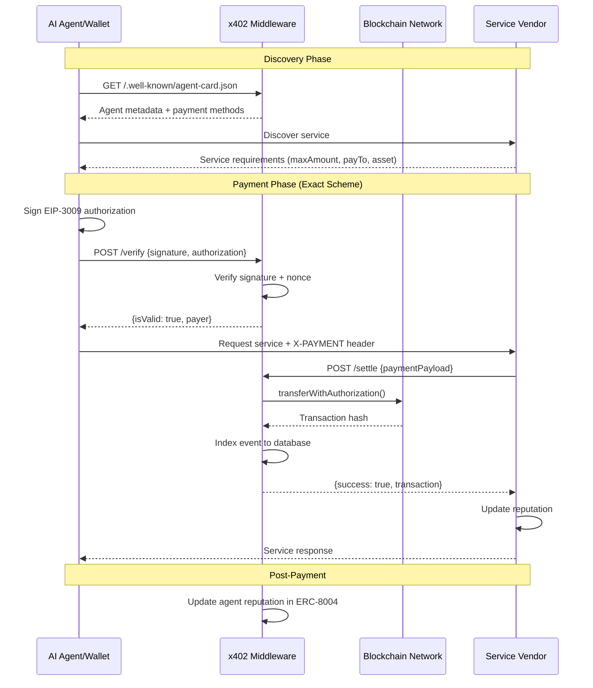
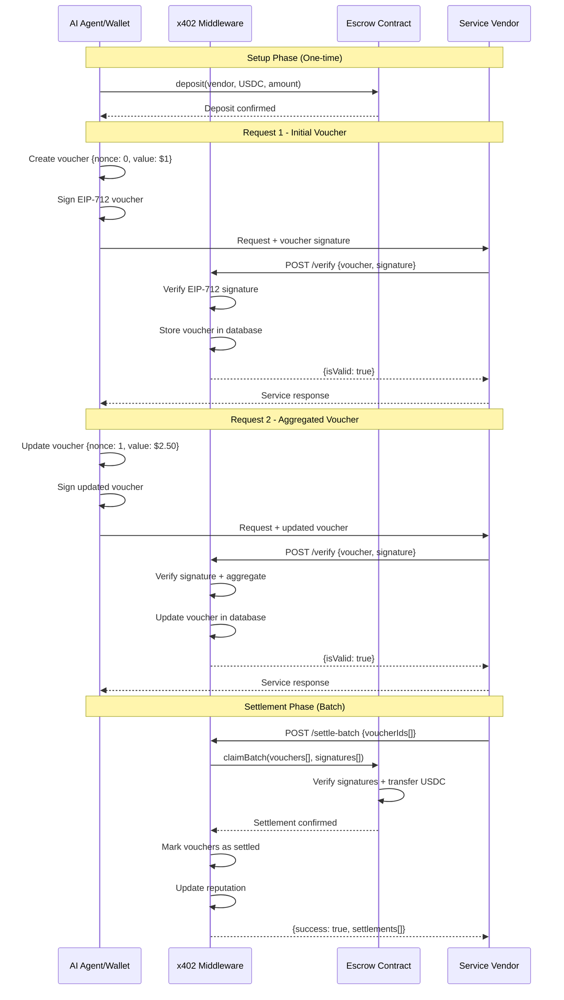
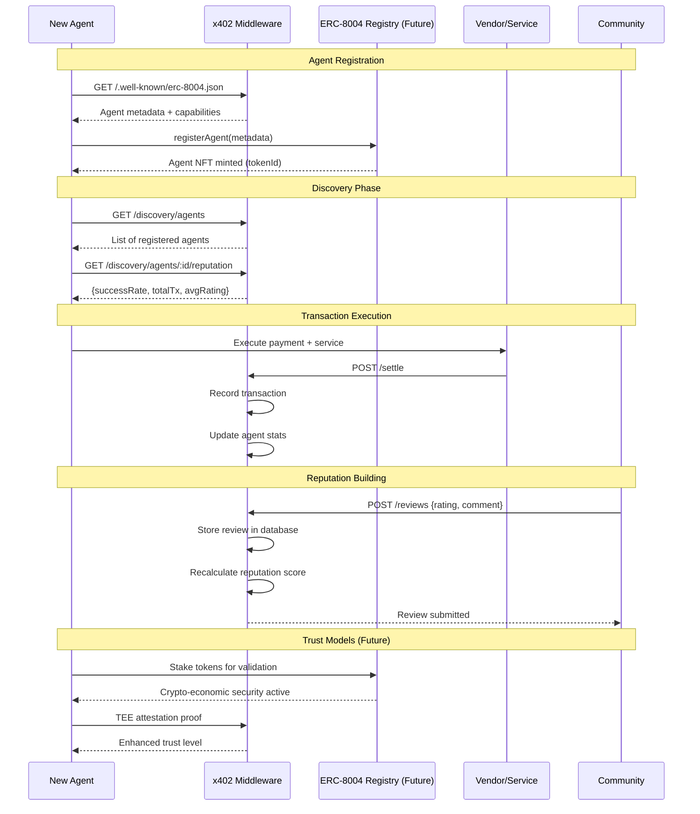

# PerkOS x402 - Multi-Chain Payment Facilitator

A **community-friendly multi-chain x402 facilitator** that implements the x402 protocol for seamless Web3 agent payments. Supports both exact (EIP-3009) and deferred (EIP-712) payment schemes across **Avalanche, Base, and Celo** networks with full **ERC-8004** agent discovery and reputation tracking.

## Protocol Compatibility

This facilitator implements the **official x402 standard** as defined by:

- [x402 GitBook](https://x402.gitbook.io/x402/core-concepts/facilitator)
- [CDP x402 Documentation](https://docs.cdp.coinbase.com/x402/core-concepts/facilitator)
- [x402 GitHub](https://github.com/coinbase/x402)

All API endpoints use the **exact same request/response format** as the CDP facilitator.

## ✨ Key Features

- ✅ **Multi-Chain Support**: Avalanche (43114), Base (8453), Celo (42220) + testnets
- ✅ **Dual Payment Schemes**: Exact (EIP-3009) and Deferred (EIP-712) payments
- ✅ **ERC-8004 Compliance**: Trustless agent discovery and reputation tracking
- ✅ **Gasless Transactions**: Zero gas fees for users via Thirdweb sponsorship
- ✅ **Upgradeable Contracts**: UUPS proxy pattern for bug fixes and feature additions
- ✅ **Community Focus**: Built for community adoption with easy onboarding
- ✅ **Modern Stack**: Next.js 15, React 19, TypeScript, Viem 2.40+, Thirdweb 5.114+

## 🌐 Supported Networks

| Network | Chain ID | Type | USDC Address | Status |
|---------|----------|------|--------------|--------|
| **Avalanche C-Chain** | 43114 | Mainnet | `0xB97EF...c48a6E` | ✅ Active |
| **Base** | 8453 | Mainnet | `0x83358...dA02913` | ✅ Active |
| **Celo** | 42220 | Mainnet | `0xcebA9...2118C` | 🔧 Infrastructure |
| **Avalanche Fuji** | 43113 | Testnet | `0x54258...31Bc65` | ✅ Active |
| **Base Sepolia** | 84532 | Testnet | `0x036Cb...3dCF7e` | ✅ Active |
| **Celo Sepolia** | 11142220 | Testnet | TBD | 🔧 Infrastructure |

**Payment Schemes:**
- **Exact** (`exact`): Immediate settlement via EIP-3009 `transferWithAuthorization` - ✅ Production
- **Deferred** (`deferred`): Off-chain voucher aggregation with UUPS upgradeable escrow - ✅ Production

### 2. Discovery Service

- **Bazaar Discovery**: Service listing and discovery for AI agents
- **Well-Known Endpoints**: `/.well-known/agent-card.json`, `/.well-known/x402-payment.json`
- **Service Marketplace**: Browse and discover payment-enabled services

### 3. ERC-8004 Reputation Agent System

- **Agent Identity**: On-chain agent registration and verification
- **Reputation Tracking**: Transaction history, success rates, community ratings
- **Trust Models**: Reputation-based (active), crypto-economic validation (planned), TEE attestation (planned)
- **A2A Protocol**: Agent-to-agent communication support

## 🚀 Quick Start

### Prerequisites

- Node.js 18+ (recommend 20+)
- npm, yarn, or pnpm
- Wallet with testnet tokens (Fuji AVAX, Base Sepolia ETH)

### 1. Install

```bash
cd MiddlewareApp
npm install
cp .env.example .env
```

### 2. Configure Environment

```bash
# Network Configuration
NEXT_PUBLIC_AVALANCHE_RPC=https://api.avax.network/ext/bc/C/rpc
NEXT_PUBLIC_BASE_RPC=https://mainnet.base.org
NEXT_PUBLIC_CELO_RPC=https://forno.celo.org

# Thirdweb Configuration
NEXT_PUBLIC_THIRDWEB_CLIENT_ID=your_client_id_here

# Facilitator Configuration
NEXT_PUBLIC_FACILITATOR_NAME="PerkOS x402 Facilitator"
NEXT_PUBLIC_FACILITATOR_URL=https://x402.perkos.io
NEXT_PUBLIC_PAYMENT_RECEIVER=0x...  # Your wallet address

# Private Keys (Server-side only)
PRIVATE_KEY=0x...  # For settlement transactions

# Supabase (for database)
NEXT_PUBLIC_SUPABASE_URL=your_supabase_url
NEXT_PUBLIC_SUPABASE_ANON_KEY=your_supabase_key
```

### 3. Deploy Upgradeable Contracts

```bash
# Deploy to testnet (recommended first)
npm run deploy:avalanche-fuji
npm run deploy:base-sepolia

# Deploy to mainnet
npm run deploy:avalanche
npm run deploy:base

# Update .env with deployed proxy addresses
NEXT_PUBLIC_AVALANCHE_ESCROW_ADDRESS=0x...
NEXT_PUBLIC_BASE_ESCROW_ADDRESS=0x...
```

### 4. Start Development Server

```bash
npm run dev
# Server runs on http://localhost:3402
```

### 5. Build for Production

```bash
npm run build
npm start
```

## Standard Facilitator API

These endpoints match the **CDP facilitator specification exactly**.

### POST /verify

Verifies a payment payload without executing settlement.

**Request:**
```json
{
  "x402Version": 1,
  "paymentPayload": {
    "x402Version": 1,
    "scheme": "exact",
    "network": "avalanche",
    "payload": {
      "signature": "0x...",
      "authorization": {
        "from": "0x742d35Cc6634C0532925a3b844Bc454e4438f44e",
        "to": "0x742d35Cc6634C0532925a3b844Bc454e4438f44e",
        "value": "1000000",
        "validAfter": "0",
        "validBefore": "1735689600",
        "nonce": "0x1234567890abcdef..."
      }
    }
  },
  "paymentRequirements": {
    "scheme": "exact",
    "network": "avalanche",
    "maxAmountRequired": "1000000",
    "resource": "https://api.example.com/endpoint",
    "description": "API access",
    "mimeType": "application/json",
    "payTo": "0x742d35Cc6634C0532925a3b844Bc454e4438f44e",
    "maxTimeoutSeconds": 60,
    "asset": "0xB97EF9Ef8734C71904D8002F8b6Bc66Dd9c48a6E"
  }
}
```

**Response:**
```json
{
  "isValid": true,
  "invalidReason": null,
  "payer": "0x742d35Cc6634C0532925a3b844Bc454e4438f44e"
}
```

### POST /settle

Verifies and settles a payment on-chain.

**Request:** Same as `/verify`

**Response:**
```json
{
  "success": true,
  "error": null,
  "payer": "0x742d35Cc6634C0532925a3b844Bc454e4438f44e",
  "transaction": "0xabcdef...",
  "network": "avalanche"
}
```

### GET /supported

Lists supported scheme/network combinations.

**Response:**
```json
{
  "kinds": [
    { "scheme": "exact", "network": "avalanche" },
    { "scheme": "deferred", "network": "avalanche" }
  ]
}
```

## 🔗 API Endpoints Reference

The MiddlewareApp provides **15+ API endpoints** organized by functionality:

### 1. Core x402 Protocol (`/api/v2/x402/`)

Standards-compliant x402 facilitator endpoints:

| Method | Endpoint | Description | Response |
|--------|----------|-------------|----------|
| POST | `/api/v2/x402/verify` | Verify payment payload without settlement | `{isValid, invalidReason, payer}` |
| POST | `/api/v2/x402/settle` | Verify and settle payment on-chain | `{success, error, payer, transaction, network}` |
| GET | `/api/v2/x402/supported` | List supported scheme/network combinations | `{kinds: [{scheme, network}]}` |
| GET | `/api/v2/x402/config` | Get facilitator configuration | `{name, url, networks, schemes}` |
| GET | `/api/v2/x402/health` | Health check endpoint | `{status, timestamp, networks}` |

### 2. Discovery Endpoints (`/.well-known/`)

ERC-8004 and x402 discovery:

| Method | Endpoint | Description |
|--------|----------|-------------|
| GET | `/.well-known/agent-card.json` | ActivityPub-style agent metadata |
| GET | `/.well-known/erc-8004.json` | ERC-8004 agent registration info |
| GET | `/.well-known/x402-payment.json` | x402 payment configuration |

**Example Response** (`/.well-known/agent-card.json`):
```json
{
  "@context": "https://www.w3.org/ns/activitystreams",
  "id": "0x...",
  "type": "Agent",
  "name": "PerkOS x402 Facilitator",
  "capabilities": ["x402-payment-exact", "x402-payment-deferred", "erc-8004-discovery"],
  "paymentMethods": [
    {"scheme": "exact", "network": "avalanche", "asset": "0x..."},
    {"scheme": "deferred", "network": "avalanche", "asset": "0x..."}
  ]
}
```

### 3. Deferred Payment Scheme (`/api/deferred/`)

Off-chain voucher aggregation and batch settlement:

| Method | Endpoint | Description |
|--------|----------|-------------|
| GET | `/api/deferred/info` | Deferred scheme configuration and escrow addresses |
| GET | `/api/deferred/vouchers` | List all stored vouchers (paginated) |
| GET | `/api/deferred/vouchers?buyer=0x...` | Filter vouchers by buyer address |
| GET | `/api/deferred/vouchers?seller=0x...` | Filter vouchers by seller address |
| POST | `/api/deferred/vouchers/{id}/{nonce}/settle` | Settle a specific voucher on-chain |
| POST | `/api/deferred/settle-batch` | Batch settle multiple vouchers |
| GET | `/api/deferred/escrow/balance` | Query escrow balance for buyer/seller pair |

### 4. Dashboard & Analytics (`/api/dashboard/`)

Real-time analytics and statistics:

| Method | Endpoint | Description |
|--------|----------|-------------|
| GET | `/api/dashboard/stats` | Aggregated statistics (transactions, volume, networks) |
| GET | `/api/dashboard/stats?network=avalanche` | Network-specific statistics |
| GET | `/api/dashboard/stats?period=24h` | Time-filtered statistics (24h, 7d, 30d) |

**Response Example**:
```json
{
  "totalTransactions": 1234,
  "totalVolume": "1234567890",
  "activeNetworks": 3,
  "networkStats": {
    "avalanche": {"count": 800, "volume": "800000000"},
    "base": {"count": 400, "volume": "400000000"}
  }
}
```

### 5. Sponsorship (`/api/sponsor/`)

Gasless transaction management:

| Method | Endpoint | Description |
|--------|----------|-------------|
| GET | `/api/sponsor/wallets` | List sponsored wallet addresses |
| POST | `/api/sponsor/wallets` | Add wallet to sponsorship list |

### 6. Additional Endpoints

| Method | Endpoint | Description |
|--------|----------|-------------|
| GET | `/api/networks` | List all supported networks with RPC and contract info |
| GET | `/api/transactions` | Query transaction history (paginated) |
| GET | `/api/agents` | List registered agents |
| GET | `/api/marketplace` | Service marketplace listings |

## Deferred Payment Scheme

The deferred scheme enables **voucher-based payments** with on-chain escrow. See [docs/X402_DEFERRED_SCHEME.md](docs/X402_DEFERRED_SCHEME.md) for full documentation.

### Flow Overview

```
1. Buyer deposits USDC to escrow contract
2. Buyer signs EIP-712 voucher for each request
3. Seller verifies signature (off-chain, fast)
4. Seller provides service
5. Buyer aggregates vouchers (nonce++, valueAggregate+=)
6. Seller claims vouchers when ready (batched)
```

### Use Cases

- **High-frequency micropayments**: Aggregate into batched settlements
- **AI agent sessions**: Continuous usage without per-request gas
- **Subscription patterns**: Session-based billing

### Client Example

```typescript
// 1. Deposit to escrow (one-time)
await escrow.deposit(sellerAddress, usdcAddress, depositAmount);

// 2. Create voucher
const voucher = {
  id: generateVoucherId(),
  buyer: myAddress,
  seller: sellerAddress,
  valueAggregate: BigInt(1000000), // $1.00 USDC
  asset: usdcAddress,
  timestamp: BigInt(Math.floor(Date.now() / 1000)),
  nonce: 0n,
  escrow: escrowAddress,
  chainId: 43114n
};

// 3. Sign with EIP-712
const signature = await wallet.signTypedData({
  domain: {
    name: "X402DeferredEscrow",
    version: "1",
    chainId: 43114,
    verifyingContract: escrowAddress
  },
  types: {
    Voucher: [
      { name: "id", type: "bytes32" },
      { name: "buyer", type: "address" },
      { name: "seller", type: "address" },
      { name: "valueAggregate", type: "uint256" },
      { name: "asset", type: "address" },
      { name: "timestamp", type: "uint64" },
      { name: "nonce", type: "uint256" },
      { name: "escrow", type: "address" },
      { name: "chainId", type: "uint256" }
    ]
  },
  primaryType: "Voucher",
  message: voucher
});

// 4. Send request
const response = await fetch(url, {
  headers: {
    "X-PAYMENT": btoa(JSON.stringify({
      x402Version: 1,
      scheme: "deferred",
      network: "avalanche",
      payload: { voucher, signature }
    }))
  }
});

// 5. Aggregate for subsequent requests
voucher.nonce += 1n;
voucher.valueAggregate += BigInt(500000); // Add $0.50
voucher.timestamp = BigInt(Math.floor(Date.now() / 1000));
// Sign again and send...
```

## Architecture

### System Architecture



### User Flow Diagrams

#### 1. Exact Payment Flow (Agent → Middleware → Vendor)



#### 2. Deferred Payment Flow (Off-Chain Aggregation)



#### 3. Multi-Agent Discovery & Reputation



## 📂 Project Structure

```
x402-Facilitator/
├── CLAUDE.md                    # Main project documentation
├── Documents/                   # Detailed guides
│   ├── SUPABASE_SETUP.md       # Database setup
│   ├── DEPLOYMENT_CHECKLIST.md # Production deployment
│   ├── UPGRADEABLE_CONTRACTS_GUIDE.md # UUPS contracts guide
│   ├── X402_DEFERRED_SCHEME.md # Deferred payments
│   └── MULTI_CHAIN_GUIDE.md    # Multi-chain config
├── Contracts/                   # Smart contracts (Hardhat 3.x)
│   ├── contracts/
│   │   └── DeferredPaymentEscrowUpgradeable.sol # UUPS proxy
│   └── scripts/
│       └── deploy-upgradeable.ts # Deployment script
└── MiddlewareApp/              # Next.js 15 App (port 3402)
    ├── app/                    # App Router
    │   ├── page.tsx            # Landing page
    │   ├── dashboard/          # Analytics dashboard
    │   ├── networks/           # Network stats
    │   ├── transactions/       # Transaction history
    │   ├── marketplace/        # Service marketplace
    │   ├── agents/             # Community agents
    │   └── api/                # API routes (15+ endpoints)
    │       ├── v2/x402/        # x402 protocol endpoints
    │       ├── .well-known/    # Discovery endpoints
    │       ├── deferred/       # Deferred scheme API
    │       └── sponsor/        # Sponsorship endpoints
    ├── lib/                    # Core business logic
    │   ├── services/           # 6 core services
    │   │   ├── X402Service.ts         # Main orchestrator
    │   │   ├── ExactSchemeService.ts  # EIP-3009 payments
    │   │   ├── DeferredSchemeService.ts # EIP-712 payments
    │   │   ├── EventIndexer.ts        # Blockchain events
    │   │   ├── ThirdwebService.ts     # Wallet integration
    │   │   └── TurnkeyService.ts      # Wallet management
    │   ├── db/                 # Database (Supabase)
    │   ├── utils/              # Utilities
    │   │   └── chains.ts       # Multi-chain config (6 networks)
    │   └── types/              # TypeScript types
    └── DATABASE_TABLES.md      # Database schema (5 tables)
```

## 🛠 Technology Stack

### Frontend
- **Next.js 15.2.6** - React framework with App Router
- **React 19** - UI library with latest features
- **TypeScript** - Type-safe development
- **Tailwind CSS** - Utility-first styling
- **Radix UI** - Accessible components

### Blockchain & Web3
- **Viem 2.40+** - Lightweight Ethereum library
- **Thirdweb 5.114+** - Web3 SDK with sponsorship
- **Hardhat 3.x** - Smart contract development
- **OpenZeppelin** - Upgradeable contracts (UUPS)

### Backend & Database
- **Supabase** - PostgreSQL database with 5 tables
- **Next.js API Routes** - Serverless functions
- **Event Indexer** - Real-time blockchain monitoring

### Payment Protocols
- **EIP-3009** - Transfer with authorization (exact)
- **EIP-712** - Typed structured data (deferred)
- **UUPS Proxy** - Upgradeable contract pattern

## 📊 Database Schema

The system uses 5 core tables (all prefixed with `perkos_`):

1. **perkos_transactions** - Payment transactions (exact + deferred)
2. **perkos_vouchers** - Deferred payment vouchers
3. **perkos_agents** - Agent reputation and metadata
4. **perkos_reviews** - Community reviews and ratings
5. **perkos_network_stats** - Daily aggregated statistics

See [MiddlewareApp/DATABASE_TABLES.md](MiddlewareApp/DATABASE_TABLES.md) for complete schema.

## 💰 Supported Tokens

### Avalanche (43114)
| Token | Address | Decimals |
|-------|---------|----------|
| USDC | `0xB97EF9Ef8734C71904D8002F8b6Bc66Dd9c48a6E` | 6 |
| USDC.e | `0xA7D7079b0FEaD91F3e65f86E8915Cb59c1a4C664` | 6 |
| USDT | `0x9702230A8Ea53601f5cD2dc00fDBc13d4dF4A8c7` | 6 |

### Base (8453)
| Token | Address | Decimals |
|-------|---------|----------|
| USDC | `0x833589fCD6eDb6E08f4c7C32D4f71b54bdA02913` | 6 |

### Celo (42220)
| Token | Address | Decimals |
|-------|---------|----------|
| USDC | `0xcebA9300f2b948710d2653dD7B07f33A8B32118C` | 6 |

## Development

```bash
# Development with hot reload
npm run dev

# Type check
npx tsc --noEmit

# Compile contracts
npx hardhat compile

# Deploy contracts
npm run deploy:contracts -- fuji      # Testnet
npm run deploy:contracts -- mainnet   # Mainnet
```

## References

- [x402 Protocol Specification](https://github.com/coinbase/x402)
- [x402 GitBook](https://x402.gitbook.io/x402)
- [CDP x402 Documentation](https://docs.cdp.coinbase.com/x402)
- [Deferred Scheme PR #426](https://github.com/coinbase/x402/pull/426)
- [ERC-8004 Specification](https://eips.ethereum.org/EIPS/eip-8004)
- [EIP-712: Typed Data Signing](https://eips.ethereum.org/EIPS/eip-712)
- [EIP-3009: Transfer With Authorization](https://eips.ethereum.org/EIPS/eip-3009)

## License

MIT
