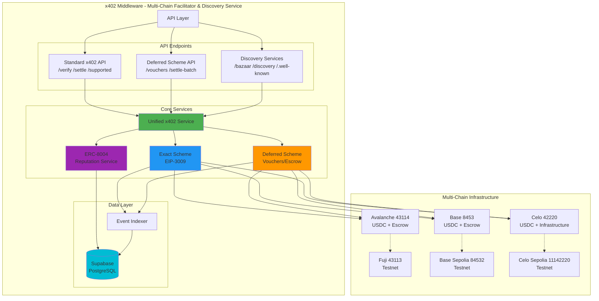
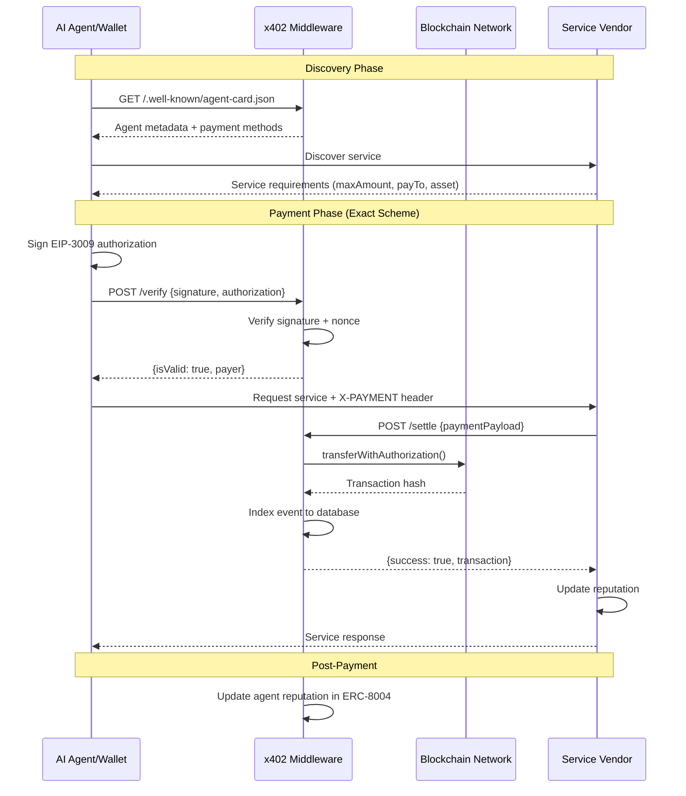
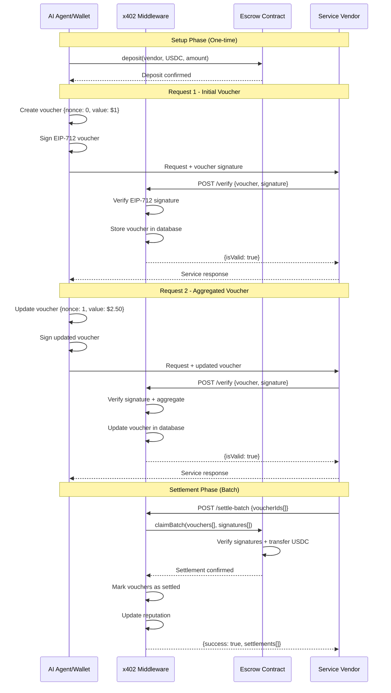
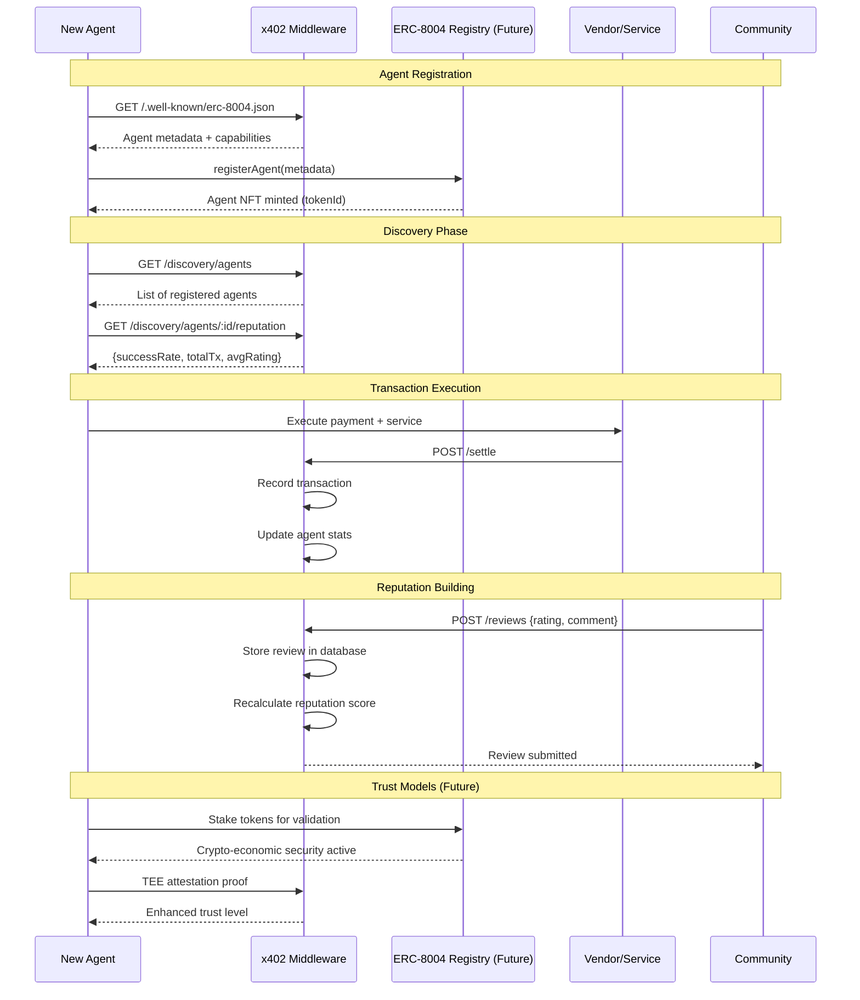

# x402 Middleware

A **multi-chain x402 facilitator**, discovery service, and **ERC-8004 reputation agent system** that enables seamless Web3 payments across Avalanche, Base, and Celo networks.

## Protocol Compatibility

This facilitator implements the **official x402 standard** as defined by:

- [x402 GitBook](https://x402.gitbook.io/x402/core-concepts/facilitator)
- [CDP x402 Documentation](https://docs.cdp.coinbase.com/x402/core-concepts/facilitator)
- [x402 GitHub](https://github.com/coinbase/x402)

All API endpoints use the **exact same request/response format** as the CDP facilitator.

## Core Capabilities

### 1. Multi-Chain x402 Facilitator

Standards-compliant payment facilitator supporting:

| Network | Chain ID | Mainnet | Testnet |
|---------|----------|---------|---------|
| Avalanche C-Chain | 43114 | ✅ | ✅ Fuji (43113) |
| Base | 8453 | ✅ | ✅ Sepolia (84532) |
| Celo | 42220 | 🔧 Infrastructure | 🔧 Sepolia (11142220) |

**Payment Schemes:**
- **Exact** (`exact`): Immediate settlement via EIP-3009 `transferWithAuthorization` - ✅ Production
- **Deferred** (`deferred`): Off-chain voucher aggregation with batch settlement ([PR #426](https://github.com/coinbase/x402/pull/426)) - ✅ Implemented

### 2. Discovery Service

- **Bazaar Discovery**: Service listing and discovery for AI agents
- **Well-Known Endpoints**: `/.well-known/agent-card.json`, `/.well-known/x402-payment.json`
- **Service Marketplace**: Browse and discover payment-enabled services

### 3. ERC-8004 Reputation Agent System

- **Agent Identity**: On-chain agent registration and verification
- **Reputation Tracking**: Transaction history, success rates, community ratings
- **Trust Models**: Reputation-based (active), crypto-economic validation (planned), TEE attestation (planned)
- **A2A Protocol**: Agent-to-agent communication support

## Quick Start

### 1. Install

```bash
npm install
cp .env.example .env
```

### 2. Configure

```bash
# Required
PRIVATE_KEY=0x...
AVALANCHE_RPC_URL=https://api.avax.network/ext/bc/C/rpc
X402_PAYMENT_TOKEN=0xB97EF9Ef8734C71904D8002F8b6Bc66Dd9c48a6E
X402_PAYMENT_RECEIVER=0x...

# Optional (enables deferred scheme)
DEFERRED_ESCROW_ADDRESS=0x...
```

### 3. Deploy Contracts

```bash
npx hardhat compile
npm run deploy:contracts -- fuji
```

### 4. Start Server

```bash
npm run dev
```

## Standard Facilitator API

These endpoints match the **CDP facilitator specification exactly**.

### POST /verify

Verifies a payment payload without executing settlement.

**Request:**
```json
{
  "x402Version": 1,
  "paymentPayload": {
    "x402Version": 1,
    "scheme": "exact",
    "network": "avalanche",
    "payload": {
      "signature": "0x...",
      "authorization": {
        "from": "0x742d35Cc6634C0532925a3b844Bc454e4438f44e",
        "to": "0x742d35Cc6634C0532925a3b844Bc454e4438f44e",
        "value": "1000000",
        "validAfter": "0",
        "validBefore": "1735689600",
        "nonce": "0x1234567890abcdef..."
      }
    }
  },
  "paymentRequirements": {
    "scheme": "exact",
    "network": "avalanche",
    "maxAmountRequired": "1000000",
    "resource": "https://api.example.com/endpoint",
    "description": "API access",
    "mimeType": "application/json",
    "payTo": "0x742d35Cc6634C0532925a3b844Bc454e4438f44e",
    "maxTimeoutSeconds": 60,
    "asset": "0xB97EF9Ef8734C71904D8002F8b6Bc66Dd9c48a6E"
  }
}
```

**Response:**
```json
{
  "isValid": true,
  "invalidReason": null,
  "payer": "0x742d35Cc6634C0532925a3b844Bc454e4438f44e"
}
```

### POST /settle

Verifies and settles a payment on-chain.

**Request:** Same as `/verify`

**Response:**
```json
{
  "success": true,
  "error": null,
  "payer": "0x742d35Cc6634C0532925a3b844Bc454e4438f44e",
  "transaction": "0xabcdef...",
  "network": "avalanche"
}
```

### GET /supported

Lists supported scheme/network combinations.

**Response:**
```json
{
  "kinds": [
    { "scheme": "exact", "network": "avalanche" },
    { "scheme": "deferred", "network": "avalanche" }
  ]
}
```

## All API Endpoints

### Standard x402 Facilitator

| Method | Endpoint | Description |
|--------|----------|-------------|
| POST | `/api/v2/x402/verify` | Verify payment payload |
| POST | `/api/v2/x402/settle` | Settle payment on-chain |
| GET | `/api/v2/x402/supported` | Supported schemes/networks |
| GET | `/api/v2/x402/health` | Health check |
| GET | `/api/v2/x402/config` | Configuration |

### Deferred Scheme Extensions

| Method | Endpoint | Description |
|--------|----------|-------------|
| GET | `/deferred/info` | Scheme configuration |
| GET | `/deferred/vouchers` | List stored vouchers |
| POST | `/deferred/vouchers` | Store a voucher |
| POST | `/deferred/vouchers/:id/:nonce/settle` | Settle specific voucher |
| POST | `/deferred/settle-batch` | Batch settle vouchers |
| GET | `/deferred/escrow/balance` | Query escrow balance |

### Bazaar Discovery

| Method | Endpoint | Description |
|--------|----------|-------------|
| GET | `/bazaar/list` | List discoverable services |
| GET | `/bazaar/services/:id` | Service details |
| GET | `/bazaar/search` | Search by capability/price |

### ERC-8004 Discovery

| Method | Endpoint | Description |
|--------|----------|-------------|
| GET | `/discovery/agents` | List registered agents |
| GET | `/discovery/agents/:id` | Agent details |
| GET | `/discovery/agents/:id/reputation` | Agent reputation |

### Well-Known

| Method | Endpoint | Description |
|--------|----------|-------------|
| GET | `/.well-known/agent-card.json` | A2A Agent Card |
| GET | `/.well-known/x402-payment.json` | x402 Payment Config |
| GET | `/.well-known/erc-8004.json` | ERC-8004 Registry Info |

## Deferred Payment Scheme

The deferred scheme enables **voucher-based payments** with on-chain escrow. See [docs/X402_DEFERRED_SCHEME.md](docs/X402_DEFERRED_SCHEME.md) for full documentation.

### Flow Overview

```
1. Buyer deposits USDC to escrow contract
2. Buyer signs EIP-712 voucher for each request
3. Seller verifies signature (off-chain, fast)
4. Seller provides service
5. Buyer aggregates vouchers (nonce++, valueAggregate+=)
6. Seller claims vouchers when ready (batched)
```

### Use Cases

- **High-frequency micropayments**: Aggregate into batched settlements
- **AI agent sessions**: Continuous usage without per-request gas
- **Subscription patterns**: Session-based billing

### Client Example

```typescript
// 1. Deposit to escrow (one-time)
await escrow.deposit(sellerAddress, usdcAddress, depositAmount);

// 2. Create voucher
const voucher = {
  id: generateVoucherId(),
  buyer: myAddress,
  seller: sellerAddress,
  valueAggregate: BigInt(1000000), // $1.00 USDC
  asset: usdcAddress,
  timestamp: BigInt(Math.floor(Date.now() / 1000)),
  nonce: 0n,
  escrow: escrowAddress,
  chainId: 43114n
};

// 3. Sign with EIP-712
const signature = await wallet.signTypedData({
  domain: {
    name: "X402DeferredEscrow",
    version: "1",
    chainId: 43114,
    verifyingContract: escrowAddress
  },
  types: {
    Voucher: [
      { name: "id", type: "bytes32" },
      { name: "buyer", type: "address" },
      { name: "seller", type: "address" },
      { name: "valueAggregate", type: "uint256" },
      { name: "asset", type: "address" },
      { name: "timestamp", type: "uint64" },
      { name: "nonce", type: "uint256" },
      { name: "escrow", type: "address" },
      { name: "chainId", type: "uint256" }
    ]
  },
  primaryType: "Voucher",
  message: voucher
});

// 4. Send request
const response = await fetch(url, {
  headers: {
    "X-PAYMENT": btoa(JSON.stringify({
      x402Version: 1,
      scheme: "deferred",
      network: "avalanche",
      payload: { voucher, signature }
    }))
  }
});

// 5. Aggregate for subsequent requests
voucher.nonce += 1n;
voucher.valueAggregate += BigInt(500000); // Add $0.50
voucher.timestamp = BigInt(Math.floor(Date.now() / 1000));
// Sign again and send...
```

## Architecture

### System Architecture



### User Flow Diagrams

#### 1. Exact Payment Flow (Agent → Middleware → Vendor)



#### 2. Deferred Payment Flow (Off-Chain Aggregation)



#### 3. Multi-Agent Discovery & Reputation



## Supported Tokens (Multi-Chain)

### Avalanche (43114)
| Token | Address | Decimals |
|-------|---------|----------|
| USDC | `0xB97EF9Ef8734C71904D8002F8b6Bc66Dd9c48a6E` | 6 |
| USDC.e | `0xA7D7079b0FEaD91F3e65f86E8915Cb59c1a4C664` | 6 |
| USDT | `0x9702230A8Ea53601f5cD2dc00fDBc13d4dF4A8c7` | 6 |

### Base (8453)
| Token | Address | Decimals |
|-------|---------|----------|
| USDC | `0x833589fCD6eDb6E08f4c7C32D4f71b54bdA02913` | 6 |

### Celo (42220)
| Token | Address | Decimals |
|-------|---------|----------|
| USDC | `0xcebA9300f2b948710d2653dD7B07f33A8B32118C` | 6 |

## Development

```bash
# Development with hot reload
npm run dev

# Type check
npx tsc --noEmit

# Compile contracts
npx hardhat compile

# Deploy contracts
npm run deploy:contracts -- fuji      # Testnet
npm run deploy:contracts -- mainnet   # Mainnet
```

## References

- [x402 Protocol Specification](https://github.com/coinbase/x402)
- [x402 GitBook](https://x402.gitbook.io/x402)
- [CDP x402 Documentation](https://docs.cdp.coinbase.com/x402)
- [Deferred Scheme PR #426](https://github.com/coinbase/x402/pull/426)
- [ERC-8004 Specification](https://eips.ethereum.org/EIPS/eip-8004)
- [EIP-712: Typed Data Signing](https://eips.ethereum.org/EIPS/eip-712)
- [EIP-3009: Transfer With Authorization](https://eips.ethereum.org/EIPS/eip-3009)

## License

MIT
