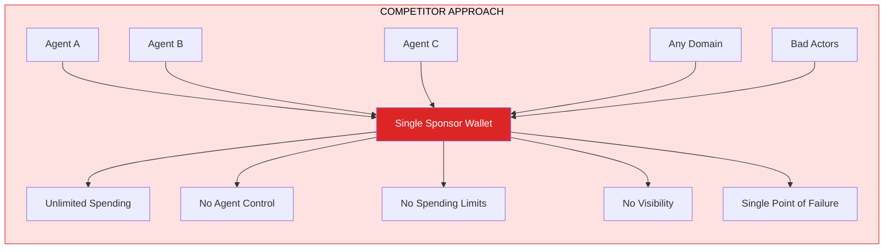
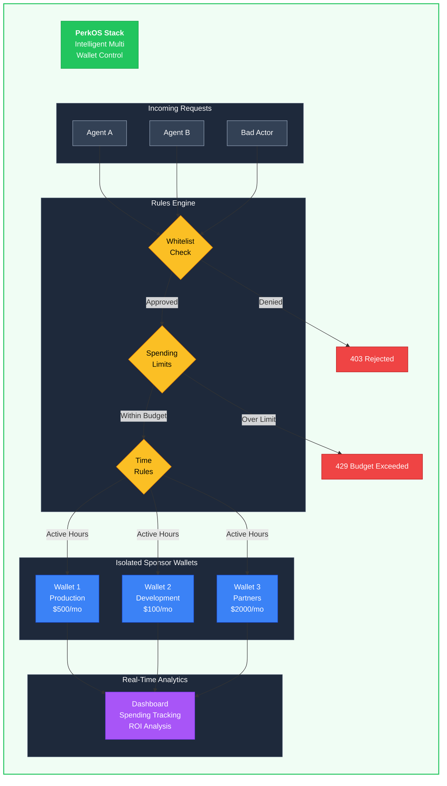
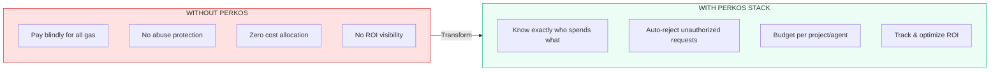
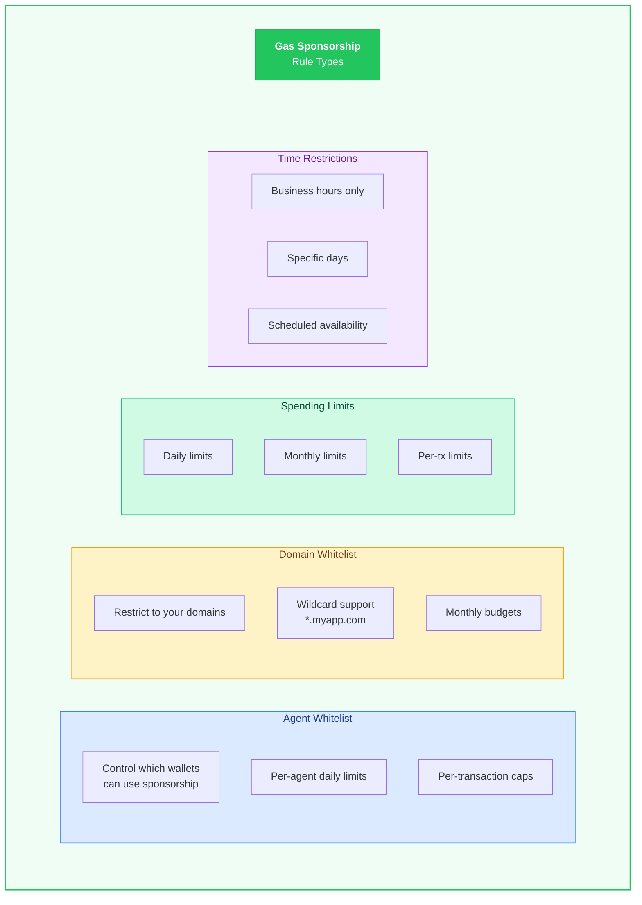
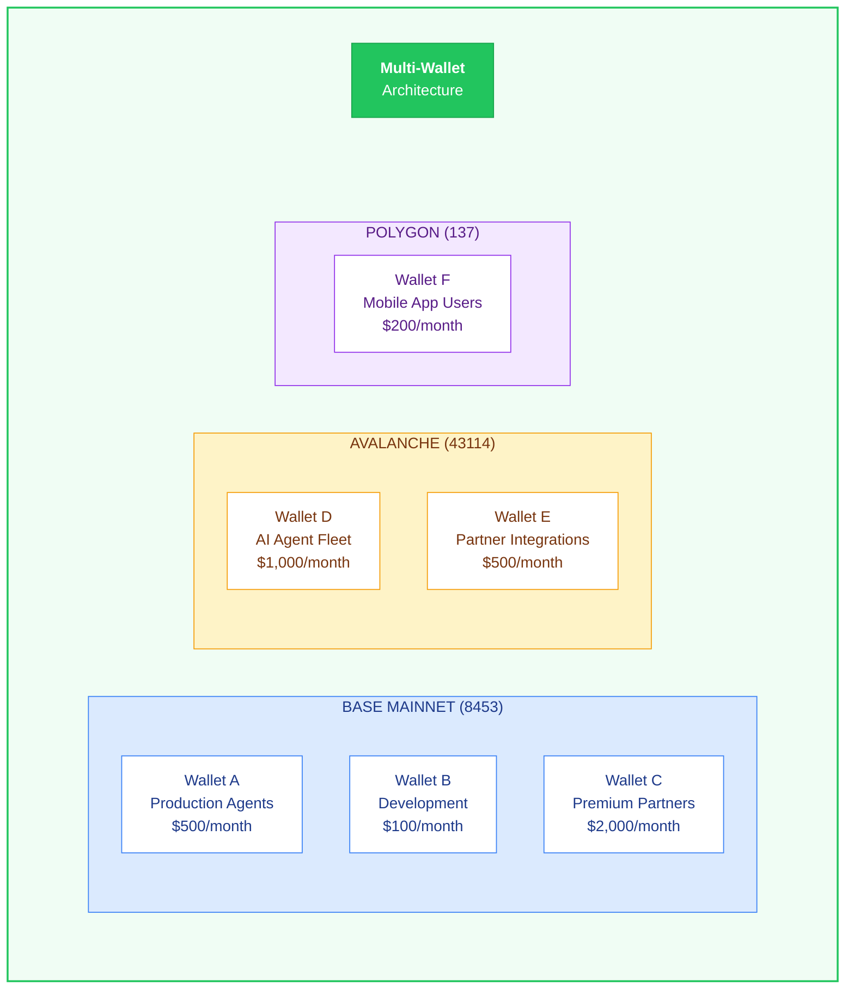
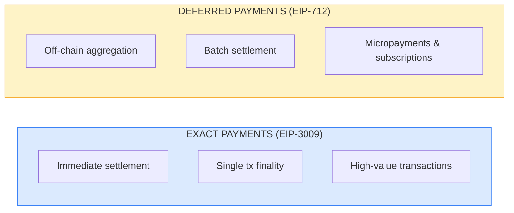
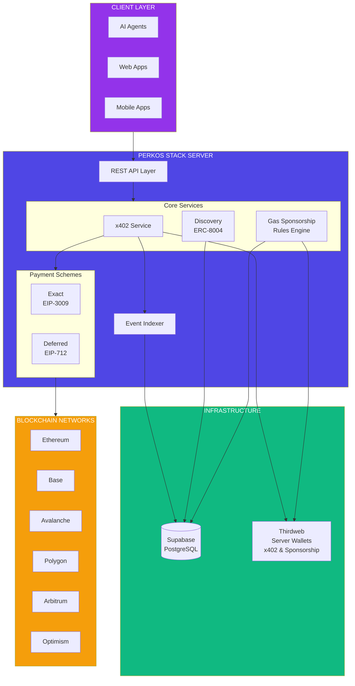
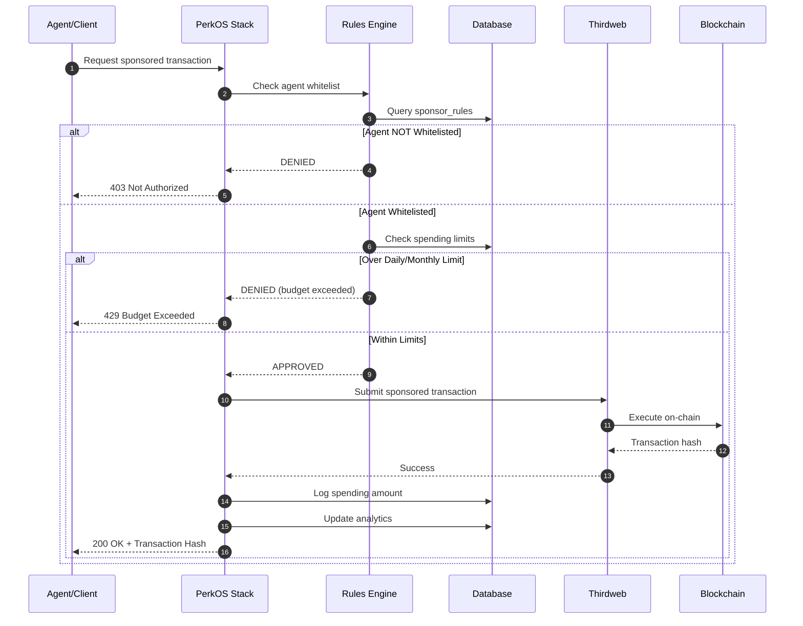
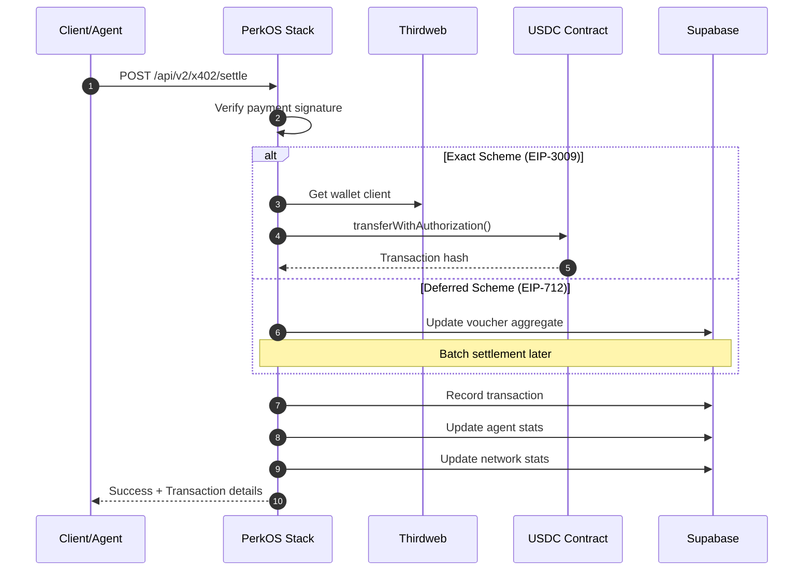

<div align="center">


# PerkOS Stack

### The Complete Agent Infrastructure Platform

**One integration. Complete infrastructure. Total control.**

[](https://github.com/coinbase/x402)
[](https://eips.ethereum.org/EIPS/eip-8004)
[](#supported-networks)
[](#-advanced-gas-sponsorship-control)
[](LICENSE)

[Why PerkOS?](#-why-perkos-stack-beats-competitors) | [Gas Control](#-advanced-gas-sponsorship-control) | [Quick Start](#-quick-start) | [API Reference](#-api-reference)

</div>

---

## Why PerkOS Stack Beats Competitors

### The Industry Problem

Most payment infrastructure solutions give you a **single wallet** that pays for everything with zero control:



**Problems with this approach:**
- No visibility into which agent is spending what
- No way to set limits per agent, domain, or time period
- No way to whitelist specific agents or domains
- Single point of failure - one compromise drains everything
- Zero accountability - impossible to track costs
- No business benefit from sponsoring transactions

### The PerkOS Stack Solution

PerkOS Stack provides **granular gas sponsorship control** that puts YOU in charge:



---

## Competitor Comparison

<div align="center">

| Feature | PerkOS Stack | Other Solutions |
|:--------|:------------:|:---------------:|
| **Multi-wallet per network** | **Unlimited** | Single wallet |
| **Agent whitelisting** | **Per-agent control** | Open to all |
| **Domain restrictions** | **Wildcard support** | None |
| **Per-transaction limits** | **Configurable** | None |
| **Daily spending limits** | **Per wallet/agent** | None |
| **Monthly spending limits** | **Per wallet/agent** | None |
| **Time-based restrictions** | **Hours & days** | None |
| **Real-time spending analytics** | **Full dashboard** | Basic/None |
| **Multi-network support** | **16 networks** | Limited |
| **Spending tracking per agent** | **Complete history** | Aggregate only |
| **Rule priority system** | **Flexible rules** | None |
| **Wallet isolation** | **Per-purpose wallets** | Shared risk |

</div>

### Business Impact



---

## Advanced Gas Sponsorship Control

### Rule Types

PerkOS Stack supports **4 types of granular control rules**:



#### 1. Agent Whitelist (`agent_whitelist`)

Control exactly which wallet addresses can use your sponsorship:

```typescript
{
  rule_type: "agent_whitelist",
  agent_address: "0x742d35Cc6634C0532925a3b844Bc454e4438f44e",
  daily_limit_wei: "50000000000000000000",    // 50 USDC daily max
  per_transaction_limit_wei: "500000000000000000", // 0.5 USDC per tx
  enabled: true
}
```

#### 2. Domain Whitelist (`domain_whitelist`)

Restrict sponsorship to specific service domains:

```typescript
{
  rule_type: "domain_whitelist",
  domain: "*.myapp.com",  // Wildcard support
  daily_limit_wei: "100000000000000000000",
  monthly_limit_wei: "2000000000000000000000",
  enabled: true
}
```

#### 3. Spending Limits (`spending_limit`)

Set precise budget controls at multiple levels:

```typescript
{
  rule_type: "spending_limit",
  daily_limit_wei: "100000000000000000000",     // $100/day
  monthly_limit_wei: "2000000000000000000000",  // $2,000/month
  per_transaction_limit_wei: "5000000000000000000", // $5/transaction
  enabled: true
}
```

#### 4. Time Restrictions (`time_restriction`)

Limit sponsorship to specific business hours:

```typescript
{
  rule_type: "time_restriction",
  active_hours_start: 9,   // 9 AM
  active_hours_end: 18,    // 6 PM
  active_days: ["monday", "tuesday", "wednesday", "thursday", "friday"],
  enabled: true
}
```

### Multi-Wallet Architecture

Create **multiple sponsor wallets per network** for complete isolation:



### Real-Time Spending Analytics

Track every sponsored transaction with complete visibility:

```sql
-- View: perkos_sponsor_wallet_analytics
SELECT
    wallet_id,
    total_transactions,
    successful_transactions,
    failed_transactions,
    total_spent,
    avg_transaction_cost,
    unique_domains,      -- How many services used this wallet
    unique_agents        -- How many agents used this wallet
FROM perkos_sponsor_wallet_analytics;
```

**Dashboard features:**
- Real-time spending by wallet, agent, and domain
- Daily/monthly trend charts
- Cost per agent breakdown
- Overage alerts and notifications
- Export capabilities for accounting

---

## What is PerkOS Stack?

**PerkOS Stack** is a production-ready middleware server that provides everything you need to build agent-powered applications:


**Core Capabilities:**
- **Payments** - x402 micropayments with immediate and deferred settlement
- **Discovery** - ERC-8004 compliant agent identity and reputation
- **Multi-Chain** - 16 EVM networks with native Circle USDC support
- **Analytics** - Real-time dashboards and transaction monitoring
- **Gas Sponsorship** - Gasless transactions with granular control

---

## Key Benefits

### 1. Deploy in Minutes, Not Months

| Without PerkOS Stack | With PerkOS Stack |
|---------------------|-------------------|
| Build x402 verification logic | `POST /api/v2/x402/verify` |
| Implement EIP-3009 settlement | `POST /api/v2/x402/settle` |
| Create discovery endpoints | `GET /.well-known/agent-card.json` |
| Build gas control system | Pre-built with rules engine |
| Setup database schema | Pre-configured Supabase |
| Configure multiple RPCs | 16 networks ready |
| Build analytics dashboard | Included with real-time data |

**Time to production: Hours instead of months.**

### 2. Multi-Chain by Default

Connect to **16 EVM networks** without managing multiple RPC connections:

| Mainnet | Testnet |
|---------|---------|
| Ethereum (1) | Sepolia (11155111) |
| Avalanche (43114) | Fuji (43113) |
| Base (8453) | Base Sepolia (84532) |
| Polygon (137) | Polygon Amoy (80002) |
| Arbitrum (42161) | Arbitrum Sepolia (421614) |
| Optimism (10) | OP Sepolia (11155420) |
| Celo (42220) | Celo Sepolia (11142220) |
| Monad (10142) | Monad Testnet (10143) |

**All with official Circle USDC addresses configured.**

### 3. Dual Payment Schemes



```typescript
// Same API, different schemes
const exactPayment = { scheme: "exact", network: "base", ... };
const deferredPayment = { scheme: "deferred", network: "base", ... };
```

### 4. Built-in Discovery (ERC-8004)

Your agents are automatically discoverable:

```json
GET /.well-known/agent-card.json
{
  "@context": "https://www.w3.org/ns/activitystreams",
  "type": "Agent",
  "name": "Your Service",
  "capabilities": ["x402-payment-exact", "x402-payment-deferred"],
  "paymentMethods": [...]
}
```

### 5. Complete Business Intelligence

Track everything out of the box:
- Transaction volume by network, agent, and domain
- Gas sponsorship ROI per wallet and agent
- Success rates and error tracking
- Agent reputation scores
- Daily/weekly/monthly spending trends
- Automated alerts for budget overages

---

## Quick Start

### Prerequisites

- Node.js 18+ (recommend 20+)
- Supabase account (free tier works)
- Thirdweb account (for gas sponsorship)

### 1. Clone and Install

```bash
git clone https://github.com/perkos/PerkOS-Stack.git
cd PerkOS-Stack/StackApp
npm install
```

### 2. Configure Environment

```bash
cp .env.example .env
```

**Required variables:**
```bash
# Your private key for settlement transactions
PRIVATE_KEY=0x...

# Where payments are received
NEXT_PUBLIC_PAYMENT_RECEIVER=0x...

# Supabase (database)
NEXT_PUBLIC_SUPABASE_URL=https://xxx.supabase.co
NEXT_PUBLIC_SUPABASE_ANON_KEY=your-anon-key

# Thirdweb (gas sponsorship)
NEXT_PUBLIC_THIRDWEB_CLIENT_ID=your-client-id
THIRDWEB_SECRET_KEY=your-secret-key
```

### 3. Setup Database

Run the SQL migrations in Supabase:
```bash
# See StackApp/supabase/migrations/ for schema files
```

### 4. Start the Server

```bash
npm run dev
# Server runs on http://localhost:3402
```

### 5. Test Your Setup

```bash
# Check health
curl http://localhost:3402/api/v2/x402/health

# Get supported networks
curl http://localhost:3402/api/v2/x402/supported

# View agent card
curl http://localhost:3402/api/.well-known/agent-card.json
```

---

## API Reference

### Core x402 Endpoints

| Method | Endpoint | Description |
|--------|----------|-------------|
| `POST` | `/api/v2/x402/verify` | Verify payment without settlement |
| `POST` | `/api/v2/x402/settle` | Verify and settle on-chain |
| `GET` | `/api/v2/x402/supported` | List supported schemes/networks |
| `GET` | `/api/v2/x402/config` | Get facilitator configuration |
| `GET` | `/api/v2/x402/health` | Health check |

### Gas Sponsorship Endpoints

| Method | Endpoint | Description |
|--------|----------|-------------|
| `GET` | `/api/sponsor/wallets` | List sponsor wallets |
| `POST` | `/api/sponsor/wallets` | Create sponsor wallet |
| `GET` | `/api/sponsor/wallets/{id}/balance` | Check wallet balance |
| `GET` | `/api/sponsor/rules` | List sponsorship rules |
| `POST` | `/api/sponsor/rules` | Create/update rules |
| `GET` | `/api/sponsor/analytics` | Spending analytics |

### Discovery Endpoints

| Method | Endpoint | Description |
|--------|----------|-------------|
| `GET` | `/.well-known/agent-card.json` | ActivityPub-style agent metadata |
| `GET` | `/.well-known/erc-8004.json` | ERC-8004 registration |
| `GET` | `/.well-known/x402-payment.json` | Payment configuration |

### Deferred Payment Endpoints

| Method | Endpoint | Description |
|--------|----------|-------------|
| `GET` | `/api/deferred/info` | Deferred scheme info |
| `GET` | `/api/deferred/vouchers` | List vouchers |
| `POST` | `/api/deferred/settle-batch` | Batch settle vouchers |
| `GET` | `/api/deferred/escrow/balance` | Check escrow balance |

### Analytics Endpoints

| Method | Endpoint | Description |
|--------|----------|-------------|
| `GET` | `/api/dashboard/stats` | Aggregated statistics |
| `GET` | `/api/transactions` | Transaction history |
| `GET` | `/api/agents` | Registered agents |

---

## Supported Networks

### Mainnet Networks (8)

| Network | Chain ID | Native | USDC Address |
|---------|----------|--------|--------------|
| Ethereum | 1 | ETH | `0xA0b86991c6218b36c1d19D4a2e9Eb0cE3606eB48` |
| Avalanche | 43114 | AVAX | `0xB97EF9Ef8734C71904D8002F8b6Bc66Dd9c48a6E` |
| Base | 8453 | ETH | `0x833589fCD6eDb6E08f4c7C32D4f71b54bdA02913` |
| Polygon | 137 | POL | `0x3c499c542cEF5E3811e1192ce70d8cC03d5c3359` |
| Arbitrum | 42161 | ETH | `0xaf88d065e77c8cC2239327C5EDb3A432268e5831` |
| Optimism | 10 | ETH | `0x0b2C639c533813f4Aa9D7837CAf62653d097Ff85` |
| Celo | 42220 | CELO | `0xcebA9300f2b948710d2653dD7B07f33A8B32118C` |
| Monad | 10142 | MON | *Coming soon* |

### Testnet Networks (8)

| Network | Chain ID | Native | USDC Address |
|---------|----------|--------|--------------|
| Sepolia | 11155111 | ETH | `0x1c7D4B196Cb0C7B01d743Fbc6116a902379C7238` |
| Avalanche Fuji | 43113 | AVAX | `0x5425890298aed601595a70AB815c96711a31Bc65` |
| Base Sepolia | 84532 | ETH | `0x036CbD53842c5426634e7929541eC2318f3dCF7e` |
| Polygon Amoy | 80002 | POL | `0x41E94Eb019C0762f9Bfcf9Fb1E58725BfB0e7582` |
| Arbitrum Sepolia | 421614 | ETH | `0x75faf114eafb1BDbe2F0316DF893fd58CE46AA4d` |
| OP Sepolia | 11155420 | ETH | `0x5fd84259d66Cd46123540766Be93DFE6D43130D7` |
| Celo Sepolia | 11142220 | CELO | *TBD* |
| Monad Testnet | 10143 | MON | *Coming soon* |

> All USDC addresses are official Circle-issued tokens.

---

## Architecture

### System Overview



### Gas Sponsorship Flow



### Payment Settlement Flow



---

## Database Schema

PerkOS Stack uses **Supabase (PostgreSQL)** with 15 tables organized by function:

### Core x402 Tables

| Table | Purpose |
|-------|---------|
| `perkos_x402_transactions` | All payment records |
| `perkos_x402_agents` | Agent statistics |
| `perkos_x402_network_stats` | Network analytics |
| `perkos_vouchers` | Deferred payment vouchers |

### Gas Sponsorship Tables (Unique to PerkOS)

| Table | Purpose |
|-------|---------|
| `perkos_sponsor_wallets` | Multi-wallet configuration per network |
| `perkos_sponsor_rules` | Agent/domain/spending/time rules |
| `perkos_sponsor_spending` | Per-agent spending tracking |
| `perkos_sponsor_transactions` | Complete sponsored tx logs |

### Vendor Registry

| Table | Purpose |
|-------|---------|
| `perkos_vendors` | Registered services |
| `perkos_vendor_endpoints` | API pricing |
| `perkos_vendor_verifications` | Discovery checks |

### User Management

| Table | Purpose |
|-------|---------|
| `perkos_user_profiles` | User accounts |
| `perkos_agents` | Agent reputation |
| `perkos_reviews` | Community ratings |

See [StackApp/DATABASE_TABLES.md](StackApp/DATABASE_TABLES.md) for complete schema.

---

## Technology Stack

| Layer | Technology |
|-------|------------|
| **Framework** | Next.js 15, React 19, TypeScript |
| **Database** | Supabase (PostgreSQL) |
| **Blockchain** | Viem 2.40+, Thirdweb 5.114+ |
| **Contracts** | Hardhat, OpenZeppelin UUPS |
| **Styling** | Tailwind CSS, Radix UI |

---

## Deployment

### Vercel (Recommended)

```bash
cd StackApp
vercel --prod
```

### Docker

```bash
docker build -t perkos-stack .
docker run -p 3402:3402 perkos-stack
```

### Smart Contracts

```bash
# Deploy escrow contracts for deferred payments
npm run deploy:base-sepolia    # Testnet
npm run deploy:base            # Mainnet

# Upgrade existing contracts (UUPS)
PROXY_ADDRESS=0x... npm run upgrade:base
```

---

## Documentation

| Document | Description |
|----------|-------------|
| [StackApp/README.md](StackApp/README.md) | Detailed API documentation |
| [Documents/SUPABASE_SETUP.md](Documents/SUPABASE_SETUP.md) | Database setup guide |
| [Documents/DEPLOYMENT_CHECKLIST.md](Documents/DEPLOYMENT_CHECKLIST.md) | Production checklist |
| [Documents/X402_DEFERRED_SCHEME.md](Documents/X402_DEFERRED_SCHEME.md) | Deferred payments guide |
| [Documents/MULTI_CHAIN_GUIDE.md](Documents/MULTI_CHAIN_GUIDE.md) | Network configuration |

---

## Protocol Compatibility

PerkOS Stack implements the **official x402 standard**:

- [x402 Protocol Specification](https://github.com/coinbase/x402)
- [x402 GitBook](https://x402.gitbook.io/x402)
- [CDP x402 Documentation](https://docs.cdp.coinbase.com/x402)
- [ERC-8004: Trustless Agents](https://eips.ethereum.org/EIPS/eip-8004)
- [EIP-3009: Transfer With Authorization](https://eips.ethereum.org/EIPS/eip-3009)
- [EIP-712: Typed Structured Data](https://eips.ethereum.org/EIPS/eip-712)

---

## Support

- **Documentation**: [StackApp/README.md](StackApp/README.md)
- **Issues**: [GitHub Issues](https://github.com/perkos/PerkOS-Stack/issues)
- **Discord**: [PerkOS Community](#)
- **Email**: support@perkos.io

---

## License

MIT License - see [LICENSE](LICENSE) for details.

---

<div align="center">

**Stack it. Control it. Scale it.**

*The only agent infrastructure with real gas control*

Built on x402 | Powered by PerkOS

</div>
