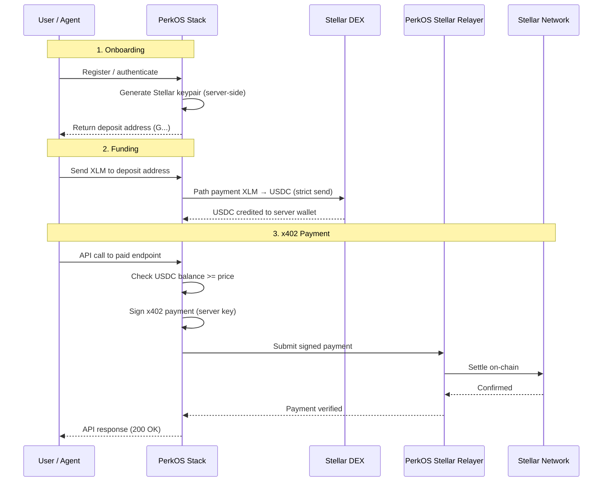

# PerkOS Stack — Stellar x402 Server Wallets

## Overview

Add Stellar payment support to PerkOS Stack via **server-managed wallets**. Users/agents deposit XLM, Stack auto-converts to USDC, and signs x402 payments on their behalf — no browser wallet required.

## Architecture



## Data Model

### Firebase: `stellarWallets` collection

```typescript
interface StellarWallet {
  // Wallet identity
  id: string;                    // auto-generated
  userId: string;                // linked PerkOS user/agent ID
  publicKey: string;             // Stellar public key (G...)
  encryptedSecret: string;       // AES-256-GCM encrypted secret key
  
  // Balances (cached, updated on tx)
  xlmBalance: string;            // native XLM balance
  usdcBalance: string;           // USDC balance (post-swap)
  
  // Config
  autoSwap: boolean;             // auto-convert XLM → USDC on deposit (default: true)
  spendingLimit: string;         // max USDC per 24h (default: "100")
  spent24h: string;              // USDC spent in rolling 24h window
  lastSpendReset: number;        // timestamp of last 24h window reset
  
  // Metadata
  createdAt: number;
  updatedAt: number;
  status: "active" | "frozen" | "closed";
}
```

### Firebase: `stellarTransactions` collection

```typescript
interface StellarTransaction {
  id: string;
  walletId: string;
  userId: string;
  type: "deposit" | "swap" | "x402_payment" | "withdrawal";
  
  // Amounts
  amount: string;
  asset: "XLM" | "USDC";
  
  // For swaps
  fromAsset?: string;
  fromAmount?: string;
  toAsset?: string;
  toAmount?: string;
  
  // Stellar details
  stellarTxHash?: string;
  ledger?: number;
  
  // x402 specific
  x402Endpoint?: string;          // e.g., "/api/weather"
  x402Vendor?: string;            // recipient service
  
  // Metadata
  status: "pending" | "confirmed" | "failed";
  createdAt: number;
}
```

## New API Endpoints

### Wallet Management

| Method | Path | Description |
|--------|------|-------------|
| `POST` | `/api/v2/stellar/wallets` | Create server wallet for authenticated user |
| `GET` | `/api/v2/stellar/wallets` | Get wallet info + balances |
| `POST` | `/api/v2/stellar/wallets/refresh` | Force balance refresh from chain |

### Funding

| Method | Path | Description |
|--------|------|-------------|
| `GET` | `/api/v2/stellar/deposit` | Get deposit address + QR code |
| `POST` | `/api/v2/stellar/swap` | Manual XLM → USDC swap |
| `GET` | `/api/v2/stellar/transactions` | Transaction history |

### x402 Payments (Server-Signed)

| Method | Path | Description |
|--------|------|-------------|
| `POST` | `/api/v2/stellar/x402/pay` | Execute x402 payment from server wallet |

## New Services

### `StellarWalletService`

```typescript
class StellarWalletService {
  // Wallet lifecycle
  createWallet(userId: string): Promise<StellarWallet>;
  getWallet(userId: string): Promise<StellarWallet | null>;
  
  // Balance management
  refreshBalance(walletId: string): Promise<{ xlm: string; usdc: string }>;
  
  // Key management (encrypted at rest)
  getKeypair(walletId: string): Promise<Keypair>;
  
  // Deposit detection
  checkDeposits(walletId: string): Promise<StellarTransaction[]>;
}
```

### `StellarSwapService`

```typescript
class StellarSwapService {
  // XLM → USDC via Stellar DEX path payment
  swapXlmToUsdc(
    keypair: Keypair,
    xlmAmount: string,
    minUsdcOut: string,
  ): Promise<{ txHash: string; usdcReceived: string }>;
  
  // Get current XLM/USDC rate
  getQuote(xlmAmount: string): Promise<{ usdcEstimate: string; rate: string }>;
}
```

### `StellarX402PaymentService`

```typescript
class StellarX402PaymentService {
  // Sign and submit x402 payment from server wallet
  executePayment(
    userId: string,
    endpoint: string,
    price: string,
  ): Promise<{ response: any; txHash: string; usdcCharged: string }>;
  
  // Check spending limits
  canSpend(userId: string, amount: string): Promise<boolean>;
}
```

## Key Management

- **Keypair generation:** `@stellar/stellar-sdk` `Keypair.random()`
- **Encryption at rest:** AES-256-GCM with per-wallet IV, master key from env (`STELLAR_WALLET_MASTER_KEY`)
- **Never log or expose secret keys**
- **Server-side only** — keys never sent to client

## XLM → USDC Swap

Use Stellar's native **path payment strict send** operation:
- Source asset: XLM (native)
- Destination asset: USDC (`CCW67TSZV3SSS2HXMBQ5JFGCKJNXKZM7UQUWUZPUTHXSTZLEO7SJMI75`)
- Stellar DEX handles routing automatically
- Set `destMin` with ~1% slippage tolerance
- Relayer sponsors the transaction fee (zero gas for user)

## Auto-Swap on Deposit

1. Stack polls Horizon for incoming XLM payments (or uses Horizon streaming)
2. On new XLM deposit → trigger swap to USDC
3. Reserve minimum 1.5 XLM for account minimum + future tx fees
4. Log swap in `stellarTransactions`

## Security

- **Spending limits:** Configurable per user (default $100/24h)
- **Rate limiting:** Max 10 x402 payments per minute per user
- **Encryption:** AES-256-GCM for secret keys, master key in env
- **Audit trail:** All transactions logged in Firebase
- **Frozen accounts:** Admin can freeze wallets
- **Minimum reserve:** Always keep 1.5 XLM for Stellar account minimum

## Environment Variables

```
STELLAR_WALLET_MASTER_KEY=<32-byte-hex-encryption-key>
STELLAR_RPC_URL=https://mainnet.sorobanrpc.com
STELLAR_HORIZON_URL=https://horizon.stellar.org
STELLAR_NETWORK_PASSPHRASE=Public Global Stellar Network ; September 2015
STELLAR_USDC_CONTRACT=CCW67TSZV3SSS2HXMBQ5JFGCKJNXKZM7UQUWUZPUTHXSTZLEO7SJMI75
```

## Integration with Existing Stack

- Uses existing Firebase (`lib/db/firebase.ts`)
- Uses existing auth middleware (`lib/middleware/apiKeyAuth.ts`)
- Adds `stellar:pubnet` to `SUPPORTED_NETWORKS` in `lib/utils/chains.ts`
- X402Service gets a new `StellarExactSchemeService` for server-signed payments
- Transaction logging via existing `TransactionLoggingService`

## Implementation Order

1. **StellarWalletService** — keypair gen, encryption, Firebase CRUD
2. **Wallet API endpoints** — create, get, deposit address
3. **StellarSwapService** — XLM→USDC via path payment
4. **Auto-swap watcher** — Horizon streaming for deposits
5. **StellarX402PaymentService** — server-signed x402 payments
6. **x402 pay endpoint** — integrate with PerkOS Relayer
7. **Spending limits + rate limiting**
8. **Dashboard UI** — balance, deposit QR, transaction history
