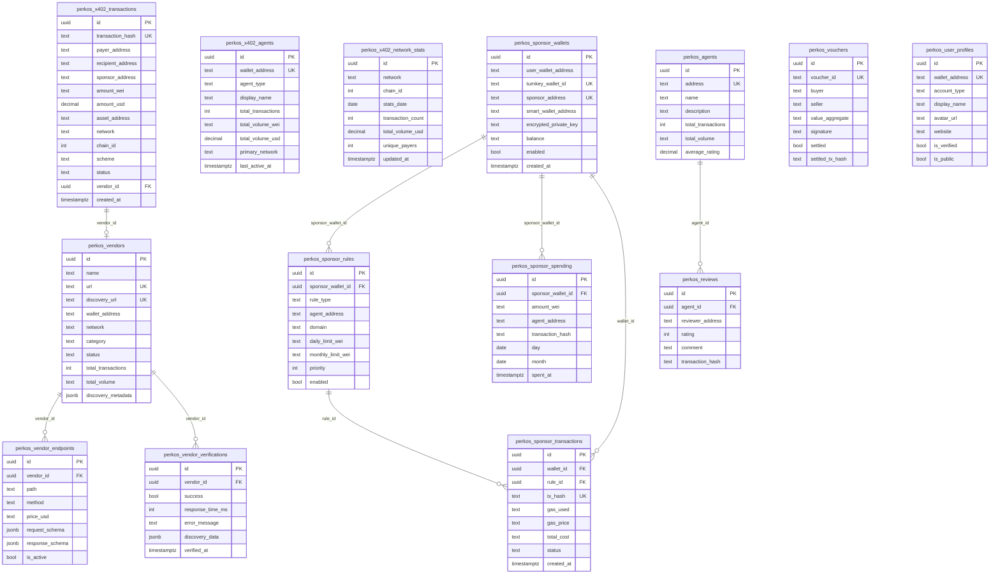
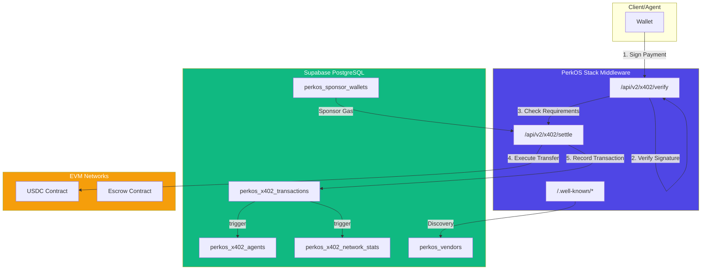
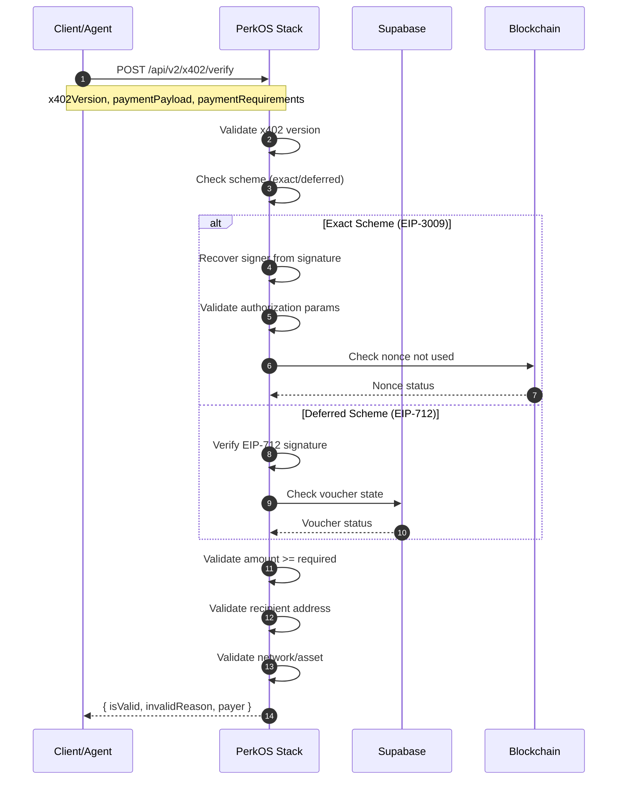
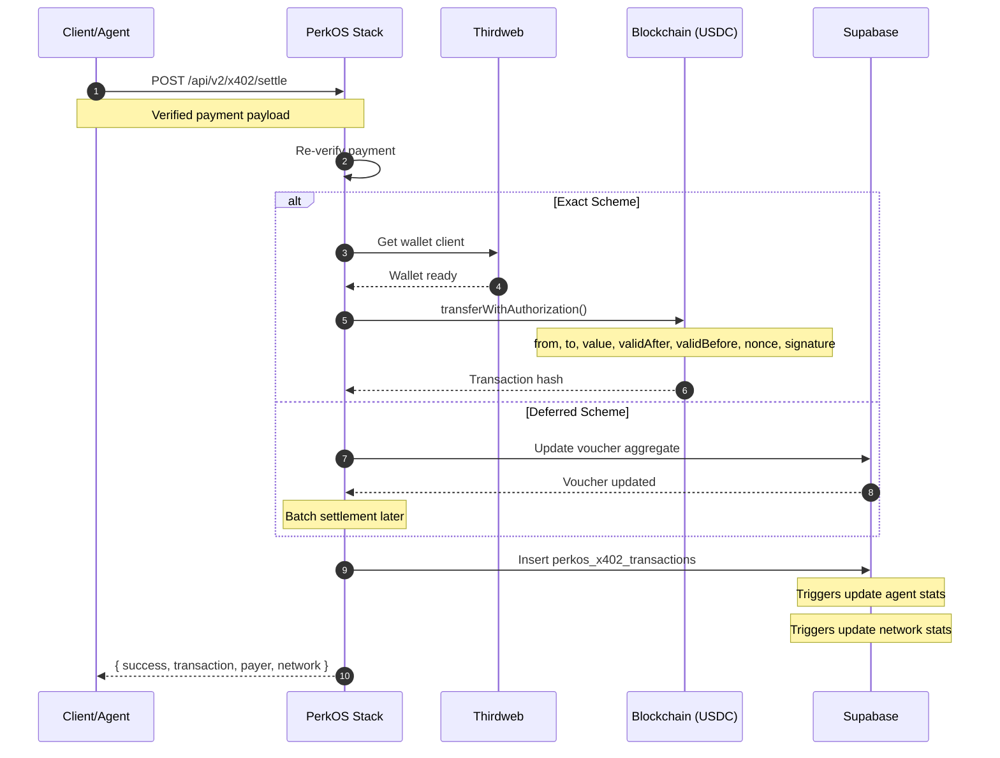
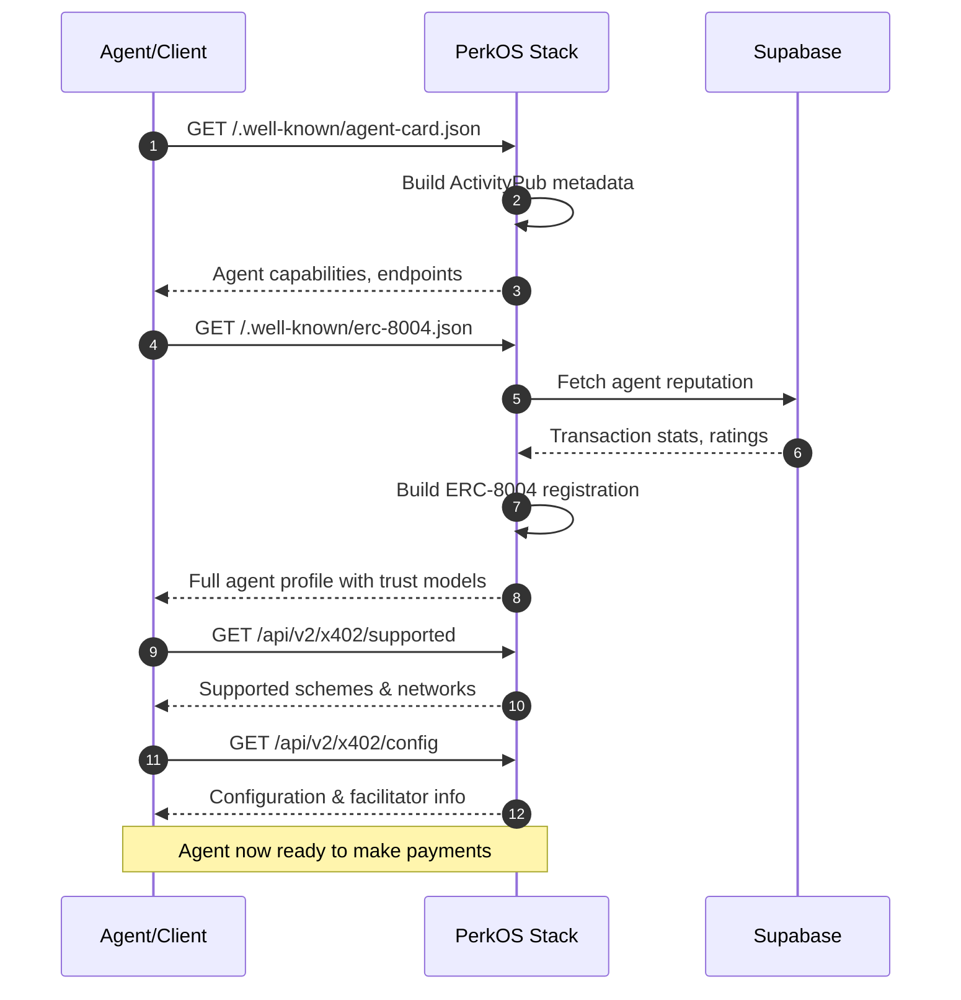
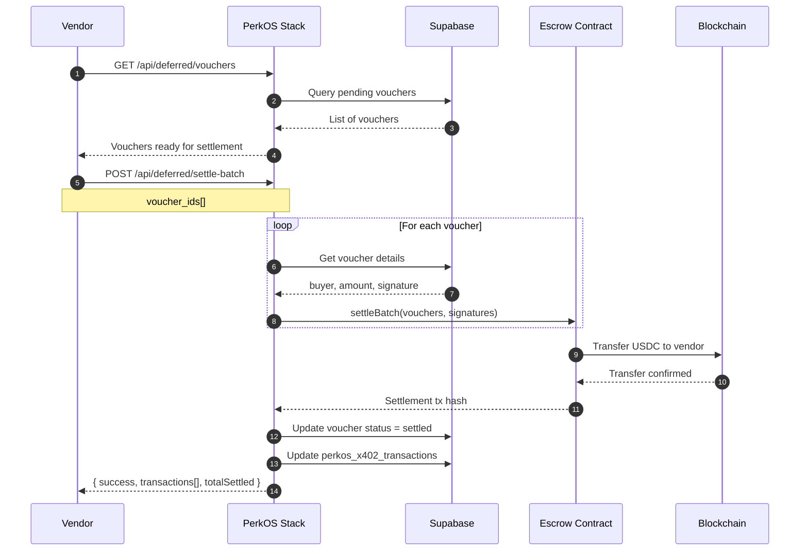
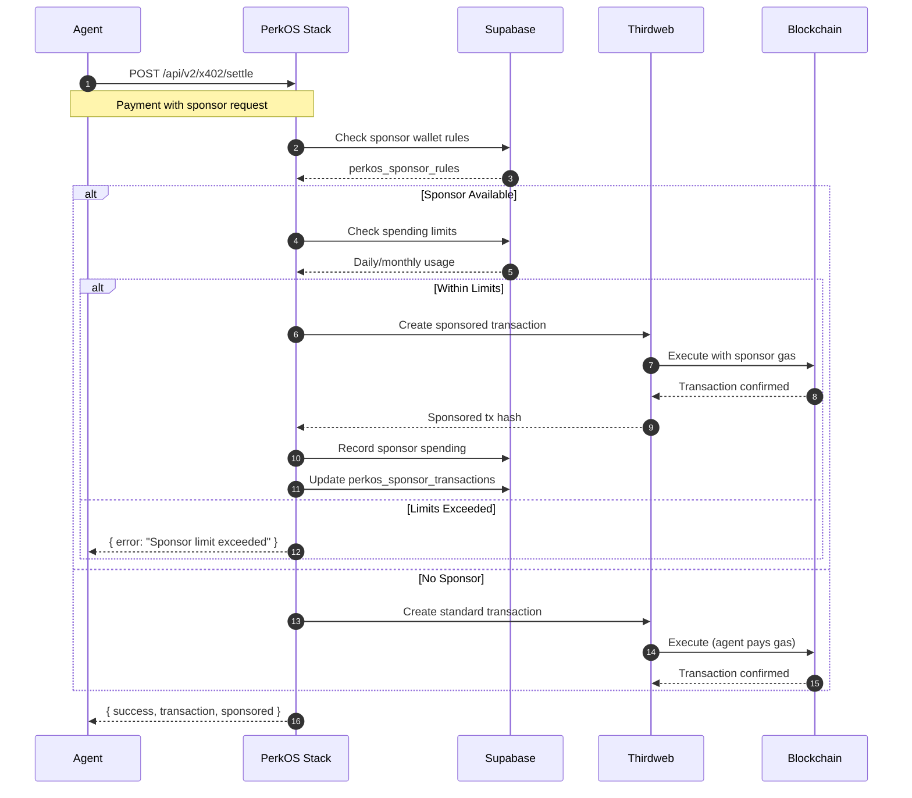

# PerkOS Stack - x402 V2 Middleware

**The most complete x402 V2 implementation available.** Enterprise-grade payment infrastructure for AI agents with full protocol compliance, multi-chain support, and production-ready features.

[](https://x402.org)
[](https://eips.ethereum.org/EIPS/eip-8004)
[]()
[](LICENSE)

## Why PerkOS Stack?

### Competitive Advantages Over Other x402 Implementations

| Feature | PerkOS Stack | Coinbase x402 | Others |
|---------|--------------|---------------|--------|
| **x402 V2 Protocol** | Full compliance | Partial | None |
| **Multi-Chain Support** | 16 networks | 1-2 networks | Limited |
| **Payment Schemes** | Exact + Deferred | Exact only | Varies |
| **ERC-8004 Discovery** | Full implementation | None | None |
| **Bazaar Indexable** | Yes | No | No |
| **V2 Response Headers** | Complete | Basic | None |
| **CAIP-2/CAIP-19** | Full support | None | None |
| **Live Reputation Stats** | Real-time | None | None |
| **Gasless Transactions** | Built-in (Thirdweb) | Manual | None |
| **Request Tracing** | V2 Request IDs | None | None |
| **Health Monitoring** | Comprehensive | Basic | Basic |
| **Settlement Receipts** | V2 format w/ explorer links | Basic | None |
| **Open Source** | Yes | Yes | Varies |

### Key Differentiators

1. **Full x402 V2 Compliance**
   - Complete V2 HTTP response headers
   - CAIP-2/CAIP-19 chain identifiers
   - V2 discovery metadata format
   - Backward compatible with V1

2. **AI Agent Discovery (ERC-8004)**
   - Trustless agent registration
   - Live reputation tracking
   - ActivityPub-compatible metadata
   - Bazaar marketplace indexing

3. **Enterprise Multi-Chain**
   - 16 EVM networks supported
   - Unified API across all chains
   - Automatic chain ID resolution
   - Block explorer integration

4. **Production-Ready Infrastructure**
   - Thirdweb gasless transactions
   - Real-time health monitoring
   - Database-backed analytics
   - Upgradeable smart contracts (UUPS)

## Features

### Protocol Support
- **x402 V2.0.0** - Full protocol compliance with V2 headers and metadata
- **EIP-3009** - Exact scheme with transferWithAuthorization
- **EIP-712** - Deferred scheme with typed structured data
- **ERC-8004** - Trustless agent discovery standard

### Discovery & Metadata (V2)
- **Bazaar Discovery** - AI agent marketplace indexing
- **Agent Card** - ActivityPub-style metadata
- **CAIP Standards** - Chain-agnostic identifiers
- **Live Reputation** - Real-time transaction stats

### Infrastructure
- **Next.js 15** - App Router architecture
- **TypeScript** - Full type safety
- **Viem 2.x** - Modern Ethereum interactions
- **Supabase** - PostgreSQL database
- **Thirdweb** - Gasless transaction sponsorship

### Supported Networks (16)

| Mainnet | Chain ID | Testnet | Chain ID |
|---------|----------|---------|----------|
| Avalanche | 43114 | Avalanche Fuji | 43113 |
| Base | 8453 | Base Sepolia | 84532 |
| Ethereum | 1 | Sepolia | 11155111 |
| Polygon | 137 | Polygon Amoy | 80002 |
| Arbitrum | 42161 | Arbitrum Sepolia | 421614 |
| Optimism | 10 | OP Sepolia | 11155420 |
| Celo | 42220 | Celo Sepolia | 11142220 |
| Monad | 10142 | Monad Testnet | 10143 |

## Quick Start

### 1. Install Dependencies

```bash
npm install
```

### 2. Configure Environment

```bash
cp .env.example .env
```

Required variables:
```bash
PRIVATE_KEY=0x...your-private-key...
NEXT_PUBLIC_PAYMENT_RECEIVER=0x...your-receiver-address...

# Database
NEXT_PUBLIC_SUPABASE_URL=https://your-project.supabase.co
NEXT_PUBLIC_SUPABASE_ANON_KEY=your-anon-key

# Thirdweb (for gasless)
NEXT_PUBLIC_THIRDWEB_CLIENT_ID=your-client-id
THIRDWEB_SECRET_KEY=your-secret-key
```

### 3. Start Development Server

```bash
npm run dev
```

Visit [http://localhost:3402](http://localhost:3402)

## API Reference

### x402 V2 Protocol Endpoints

| Method | Endpoint | Description |
|--------|----------|-------------|
| POST | `/api/v2/x402/verify` | Verify payment payload |
| POST | `/api/v2/x402/settle` | Settle payment on-chain |
| GET | `/api/v2/x402/supported` | Supported schemes/networks |
| GET | `/api/v2/x402/health` | Comprehensive health check |
| GET | `/api/v2/x402/config` | Configuration details |

### V2 Discovery Endpoints

| Method | Endpoint | Description |
|--------|----------|-------------|
| GET | `/.well-known/x402-discovery.json` | **V2 Bazaar Discovery** - Full facilitator metadata |
| GET | `/.well-known/agent-card.json` | **ActivityPub Agent Card** - AI agent metadata |
| GET | `/.well-known/erc-8004.json` | **ERC-8004 Registration** - Trust models & reputation |
| GET | `/.well-known/x402-payment.json` | **Payment Config** - Schemes & networks |

### Deferred Scheme Endpoints

| Method | Endpoint | Description |
|--------|----------|-------------|
| GET | `/api/deferred/info` | Scheme configuration |
| GET | `/api/deferred/vouchers` | List stored vouchers |
| POST | `/api/deferred/vouchers/:id/:nonce/settle` | Settle specific voucher |
| POST | `/api/deferred/settle-batch` | Batch settle vouchers |
| GET | `/api/deferred/escrow/balance` | Query escrow balance |

## x402 V2 Protocol Details

### V2 Response Headers

All x402 endpoints return standardized V2 headers:

```
X-x402-Version: 2.0.0
X-x402-Request-Id: x402-m4k5p2-a8f3b1
X-x402-Network: base
X-x402-Chain-Id: 8453
X-x402-CAIP2: eip155:8453
X-x402-Scheme: exact
X-x402-Valid: true
X-x402-Payer: 0x...
X-x402-Transaction: 0x...  (settle only)
```

### V2 Settlement Receipt

Settle responses include a detailed V2 receipt:

```json
{
  "success": true,
  "payer": "0x...",
  "transaction": "0x...",
  "network": "base",
  "receipt": {
    "version": "2.0.0",
    "requestId": "x402-m4k5p2-a8f3b1",
    "timestamp": "2025-12-14T10:30:00.000Z",
    "network": {
      "name": "base",
      "chainId": 8453,
      "caip2": "eip155:8453"
    },
    "payment": {
      "scheme": "exact",
      "payer": "0x...",
      "amount": "1000000",
      "asset": "0x833589fCD6eDb6E08f4c7C32D4f71b54bdA02913"
    },
    "settlement": {
      "success": true,
      "transaction": "0x...",
      "blockExplorer": "https://basescan.org/tx/0x..."
    }
  }
}
```

### V2 Discovery Metadata

The `/.well-known/x402-discovery.json` endpoint provides comprehensive facilitator metadata:

```json
{
  "@context": "https://x402.org/discovery/v2",
  "@type": "x402Facilitator",
  "specVersion": "2.0.0",
  "protocolVersion": 1,
  "facilitator": {
    "id": "0x...",
    "name": "PerkOS Stack",
    "description": "Enterprise x402 payment infrastructure",
    "url": "https://your-domain.com"
  },
  "capabilities": {
    "schemes": ["exact", "deferred"],
    "features": [
      "multi-chain",
      "gasless-transactions",
      "agent-discovery",
      "bazaar-indexable"
    ],
    "paymentMethods": [
      {
        "scheme": "exact",
        "network": "base",
        "chainId": 8453,
        "caip2": "eip155:8453",
        "asset": {
          "address": "0x833589fCD6eDb6E08f4c7C32D4f71b54bdA02913",
          "symbol": "USDC",
          "decimals": 6,
          "caip19": "eip155:8453/erc20:0x833589fCD6eDb6E08f4c7C32D4f71b54bdA02913"
        }
      }
    ]
  },
  "trust": {
    "model": "reputation",
    "reputation": {
      "totalTransactions": 1250,
      "successfulTransactions": 1248,
      "successRate": 99,
      "totalVolume": "125000.00",
      "lastUpdated": "2025-12-14T10:30:00.000Z"
    }
  }
}
```

### V2 Health Monitoring

Comprehensive health endpoint with network and database checks:

```json
{
  "status": "healthy",
  "version": {
    "x402": "2.0.0",
    "api": "v2",
    "protocol": 1
  },
  "timestamp": "2025-12-14T10:30:00.000Z",
  "uptime": 86400,
  "responseTime": 45,
  "checks": {
    "database": {
      "status": "healthy",
      "latency": 12
    },
    "networks": [
      {
        "network": "base",
        "chainId": 8453,
        "status": "healthy",
        "latency": 89,
        "blockNumber": 23456789
      }
    ]
  },
  "capabilities": {
    "schemes": ["exact", "deferred"],
    "deferredEnabled": true,
    "networksConfigured": 16,
    "networksHealthy": 16
  }
}
```

## Project Structure

```
StackApp/
├── app/
│   ├── api/
│   │   ├── v2/x402/              # x402 V2 Protocol
│   │   │   ├── verify/           # Payment verification
│   │   │   ├── settle/           # Payment settlement
│   │   │   ├── supported/        # Supported networks
│   │   │   ├── health/           # V2 Health monitoring
│   │   │   └── config/           # Configuration
│   │   ├── deferred/             # Deferred scheme
│   │   └── .well-known/          # V2 Discovery endpoints
│   │       ├── x402-discovery.json/
│   │       ├── agent-card.json/
│   │       ├── erc-8004.json/
│   │       └── x402-payment.json/
│   ├── dashboard/                # Admin dashboard
│   ├── transactions/             # Transaction history
│   └── networks/                 # Network stats
├── lib/
│   ├── services/                 # Business logic
│   │   ├── X402Service.ts        # Main orchestrator
│   │   ├── ExactSchemeService.ts # EIP-3009 payments
│   │   ├── DeferredSchemeService.ts # EIP-712 vouchers
│   │   └── ThirdwebService.ts    # Gasless transactions
│   ├── utils/
│   │   ├── chains.ts             # 16 network configs
│   │   ├── config.ts             # App configuration
│   │   └── x402-headers.ts       # V2 header utilities
│   ├── types/
│   │   └── x402.ts               # TypeScript definitions
│   └── db/
│       └── supabase.ts           # Database client
└── contracts/                    # Solidity (UUPS upgradeable)
```

## Database Schema

PerkOS Stack uses **Supabase (PostgreSQL)** with 15 tables organized into 5 categories:

### Core x402 Tables

| Table | Purpose | Key Fields |
|-------|---------|------------|
| `perkos_x402_transactions` | All x402 payment records | `transaction_hash`, `payer_address`, `recipient_address`, `amount_wei`, `network`, `scheme`, `status` |
| `perkos_x402_agents` | Agent stats (payers/vendors) | `wallet_address`, `agent_type`, `total_transactions`, `total_volume_usd` |
| `perkos_x402_network_stats` | Daily network analytics | `network`, `chain_id`, `stats_date`, `transaction_count`, `total_volume_usd` |

### Legacy/Alternative Tables

| Table | Purpose | Key Fields |
|-------|---------|------------|
| `perkos_transactions` | Transaction records (alt schema) | `hash`, `network`, `payer`, `payee`, `amount`, `status` |
| `perkos_vouchers` | Deferred payment vouchers | `voucher_id`, `buyer`, `seller`, `value_aggregate`, `signature`, `settled` |
| `perkos_agents` | Agent reputation data | `address`, `name`, `total_transactions`, `average_rating` |
| `perkos_reviews` | Community ratings | `agent_id`, `reviewer_address`, `rating`, `comment`, `tags` |
| `perkos_network_stats` | Network analytics (alt schema) | `network`, `chain_id`, `date`, `total_volume`, `unique_users` |

### Vendor Registry Tables

| Table | Purpose | Key Fields |
|-------|---------|------------|
| `perkos_vendors` | Registered vendor services | `name`, `url`, `discovery_url`, `wallet_address`, `category`, `status` |
| `perkos_vendor_endpoints` | API endpoints per vendor | `vendor_id`, `path`, `method`, `price_usd` |
| `perkos_vendor_verifications` | Discovery verification history | `vendor_id`, `success`, `response_time_ms`, `discovery_data` |

### Gas Sponsorship Tables

| Table | Purpose | Key Fields |
|-------|---------|------------|
| `perkos_sponsor_wallets` | Sponsor wallet management | `user_wallet_address`, `turnkey_wallet_id`, `sponsor_address`, `smart_wallet_address`, `balance` |
| `perkos_sponsor_rules` | Sponsorship rules | `sponsor_wallet_id`, `rule_type`, `agent_address`, `domain`, `daily_limit_wei` |
| `perkos_sponsor_spending` | Spending tracking | `sponsor_wallet_id`, `amount_wei`, `agent_address`, `day`, `month` |
| `perkos_sponsor_transactions` | Sponsored tx analytics | `wallet_id`, `tx_hash`, `gas_used`, `total_cost`, `status` |

### User Management Tables

| Table | Purpose | Key Fields |
|-------|---------|------------|
| `perkos_user_profiles` | User profile information | `wallet_address`, `account_type`, `display_name`, `avatar_url`, `is_verified` |

### Database Features

- **Row Level Security (RLS)**: All tables protected with appropriate policies
- **Auto-triggers**: `updated_at` timestamps, stats aggregation, spending date computation
- **Indexes**: Optimized for common queries (wallet lookups, date ranges, status filters)
- **Views**: `perkos_sponsor_wallet_analytics` for sponsor wallet metrics

### Entity Relationship Diagram



### Data Flow Diagram



### System Architecture Diagram


### Sequence Diagrams

#### x402 Payment Verification Flow



#### x402 Payment Settlement Flow



#### Agent Discovery Flow (ERC-8004)



#### Deferred Payment Batch Settlement Flow



#### Gas Sponsorship Flow



## Deployment

### Vercel (Recommended)

```bash
vercel --prod
```

### Docker

```bash
docker build -t perkos-stack .
docker run -p 3402:3402 perkos-stack
```

### Environment Variables

| Variable | Required | Description |
|----------|----------|-------------|
| `PRIVATE_KEY` | Yes | Facilitator private key |
| `NEXT_PUBLIC_PAYMENT_RECEIVER` | Yes | Payment receiver address |
| `NEXT_PUBLIC_SUPABASE_URL` | Yes | Supabase project URL |
| `NEXT_PUBLIC_SUPABASE_ANON_KEY` | Yes | Supabase anonymous key |
| `NEXT_PUBLIC_THIRDWEB_CLIENT_ID` | Yes | Thirdweb client ID |
| `THIRDWEB_SECRET_KEY` | Yes | Thirdweb secret key |
| `NEXT_PUBLIC_DEFERRED_ENABLED` | No | Enable deferred scheme |
| `NEXT_PUBLIC_FACILITATOR_NAME` | No | Facilitator display name |
| `NEXT_PUBLIC_FACILITATOR_URL` | No | Facilitator base URL |

## Smart Contracts

PerkOS Stack uses UUPS upgradeable contracts for the deferred payment escrow:

```bash
# Deploy upgradeable contracts
npm run deploy:avalanche-fuji
npm run deploy:base-sepolia

# Upgrade existing contracts
PROXY_ADDRESS=0x... npm run upgrade:avalanche-fuji
```

## Integration Example

### Verify and Settle Payment

```typescript
import { createPublicClient, http } from 'viem';
import { base } from 'viem/chains';

// 1. Client creates payment payload
const paymentPayload = {
  x402Version: 1,
  scheme: "exact",
  network: "base",
  payload: {
    signature: "0x...",
    authorization: {
      from: clientAddress,
      to: vendorAddress,
      value: "1000000", // 1 USDC
      validAfter: "0",
      validBefore: String(Math.floor(Date.now() / 1000) + 3600),
      nonce: "0x..."
    }
  }
};

// 2. Verify payment
const verifyResponse = await fetch('https://your-stack.com/api/v2/x402/verify', {
  method: 'POST',
  headers: { 'Content-Type': 'application/json' },
  body: JSON.stringify({
    x402Version: 1,
    paymentPayload,
    paymentRequirements: {
      scheme: "exact",
      network: "base",
      maxAmountRequired: "1000000",
      resource: "/api/service",
      payTo: vendorAddress,
      maxTimeoutSeconds: 3600,
      asset: "0x833589fCD6eDb6E08f4c7C32D4f71b54bdA02913"
    }
  })
});

const { isValid, payer } = await verifyResponse.json();
console.log('Request ID:', verifyResponse.headers.get('X-x402-Request-Id'));

// 3. Settle payment
if (isValid) {
  const settleResponse = await fetch('https://your-stack.com/api/v2/x402/settle', {
    method: 'POST',
    headers: { 'Content-Type': 'application/json' },
    body: JSON.stringify({ /* same payload */ })
  });

  const { success, receipt } = await settleResponse.json();
  console.log('Block Explorer:', receipt.settlement.blockExplorer);
}
```

## Resources

- [x402 Protocol V2](https://x402.org/writing/x402-v2-launch) - Official V2 announcement
- [x402 Documentation](https://x402.gitbook.io/x402) - Protocol specification
- [ERC-8004](https://eips.ethereum.org/EIPS/eip-8004) - Trustless Agent Discovery
- [EIP-3009](https://eips.ethereum.org/EIPS/eip-3009) - Transfer With Authorization
- [CAIP Standards](https://github.com/ChainAgnostic/CAIPs) - Chain Agnostic Identifiers

## Contributing

We welcome contributions! Please see [CONTRIBUTING.md](../CONTRIBUTING.md) for guidelines.

## License

MIT License - see [LICENSE](../LICENSE) for details.

---

**Built with x402 V2** | **Powered by PerkOS Stack**

*Stack it. Ship it. Scale it.*
